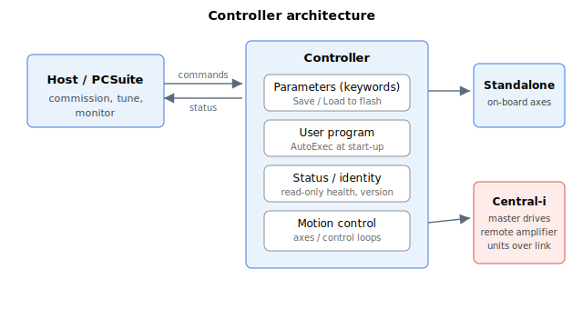

# System

**Overview:**

This category covers controller- and unit-level keywords — those that describe or act on the controller as a whole, rather than on the motion of a single axis.

It is organised into:

- **Status** — identity, firmware/FPGA version, and unit health information (mostly read-only).
- **Operation** — commands that change controller state: save/load/reset, firmware and FPGA download, and user-program auto-start.
- **Timing** — system cycle counters and timers.
- **Communication** — CAN, Ethernet, and serial (RS-232/USB) configuration, plus remote-controller messaging.
- **Central-i** — the Central-i link subsystem: connection, configuration, status, multiplexing, and offline data/logging.
