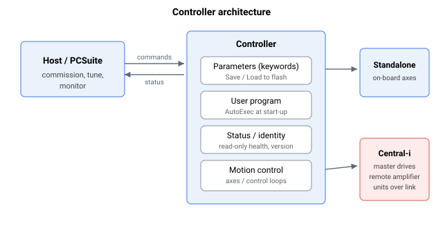

# System

**概述：**

本类别涵盖控制器级与单元级的关键字——即描述整个控制器或作用于整个控制器（而非单个轴运动）的关键字。

其组织结构如下：

- **Status** — 标识、固件/FPGA 版本以及单元健康信息（大多为只读）。
- **Operation** — 改变控制器状态的指令：保存/加载/复位、固件与 FPGA 下载，以及用户程序自启动。
- **Timing** — 系统周期计数器与定时器。
- **Communication** — CAN、以太网与串口（RS-232/USB）配置，以及远程控制器消息收发。
- **Central-i** — Central-i 链路子系统：连接、配置、状态、多路复用，以及离线数据/记录。
