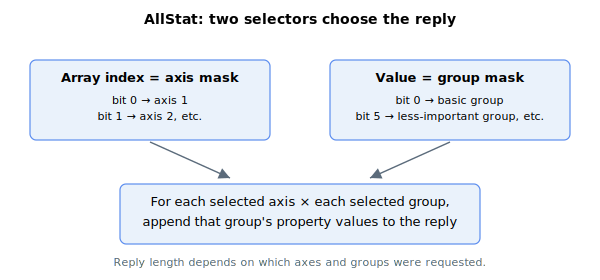

# AllStat

Ethernet-binary multi-axis status query used by the AAMotion API (being deprecated).

`AllStat` is a function that returns a bulk block of axis statuses for several axes and several status categories in a single message.

## Overview

`AllStat` is a function (not a stored value): the AAMotion API calls it to query many statuses across multiple axes in one round-trip instead of reading each keyword on each axis separately. It is supported only over **Ethernet Binary** communication. The reply is a packed block of 32-bit values whose layout depends on which axes and which status groups were requested.

> **Deprecation:** `AllStat` is scheduled to be deprecated / revamped. Avoid relying on it for new integrations.

## How it works



`AllStat` takes two selectors:

- The **array index** is an *axis mask* — bit 0 selects axis 1, bit 1 selects axis 2, and so on. The function iterates over every axis whose bit is set.
- The **function value** is a *group mask* — each bit selects one status group (see the table). The function iterates over every group whose bit is set.

For each requested axis, and within it each requested group, the firmware walks a fixed list of properties for that group and appends each property's current value to the reply, in group order. Values are converted to the keyword's user units / scaling before being appended, exactly as a direct read of that keyword would return. Properties that are functions rather than plain parameters are not supported and cause the call to return an error; out-of-range array elements append `0`.

The number of values returned therefore depends on the requested axes and groups — the host must know the group layout below to parse the block.

### Status groups (function-value mask)

| Bit | Group | Contents (summary) |
|-----|-------|--------------------|
| 0 (0x001) | Basic | MotorOn, InjectType, Pos, Vel, PosErr, VelErr, MotionStat, ConFlt, MotionReason, StatReg, LimitsStat, HomingStat, DInPort |
| 1 (0x002) | Important extras | additional Vel elements, MotorCurr, ScheduleSet, MotionSamples, InTargetStat, ComtStatus |
| 2 (0x004) | User-program | ProgStat and ProgError for each program thread |
| 3 (0x008) | Complex motion | FIFOStatus and CNCAStatus elements |
| 4 (0x010) | Central-i | CIStatus elements (see [CIStatus](../05-central-i/CIStatus.md)) |
| 5 (0x020) | Less-important extras | Ia/Ib, Id/Iq, Va/Vb/Vc, AInPort, VBus, VLogic, PwrTemp, MotorTemp, Time |
| 6 (0x040) | References | PosRef, VelRef, CurrRef, dPosRef, CNCAPosRef, CNCAdPosRef |
| 7 (0x080) | Lock & events | LockEn, LockCntr, LockVal, EventOn, EventCntr, EventNextPos, EventSelect |
| 8 (0x100) | User parameters | UserParam[1]–[5] |
| 9 (0x200) | Added extras | DInPortHigh, BoardTemp |

A further table entry exists in firmware (force / repeat: MotionSamples, ForceSamples, ForceInTStat, RptCounter), but no group-mask bit is wired to it on either firmware branch — bits beyond `0x200` therefore return nothing.

The exact property list of each group is fixed in firmware and is shared with Agito PCSuite, which knows how to decode the reply. Group contents may change between firmware releases (the [Identity](Identity.md) feature-flag words advertise some of these changes), so the block should only be parsed against the firmware version that produced it.

## Examples

```text
AAllStat[1]=1        ; axis-1 (index bit 0), basic group (value bit 0)
AAllStat[3]=0x21     ; axes 1 and 2 (index 0b11... here index bit pattern), basic + less-important groups
```

(The array index is the axis mask and the assigned value is the group mask; values are returned in the binary reply, not as a printable keyword value.)

## See also

- [UnitStat](UnitStat.md) — unit hardware/firmware health
- [CIStatus](../05-central-i/CIStatus.md) — the Central-i status group (group 4) per axis
- [StatReg](../../07-status-and-faults/StatReg.md) — the per-axis status word included in the basic group
