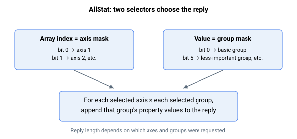

# AllStat

AAMotion API 使用的以太网二进制多轴状态查询（正在被弃用）。

`AllStat` 是一个函数，它在单条消息中返回若干轴、若干状态类别的批量轴状态块。

## 概述

`AllStat` 是一个函数（而非存储值）：AAMotion API 调用它在一次往返中查询多个轴上的多项状态，而无需在每个轴上逐个读取每个关键字。它可在控制器的所有命令通道上工作（两个 RS-232 端口、CAN 和以太网）；AAMotion API 使用**以太网二进制**路径，其回复为一个紧凑的 32 位值块，其布局取决于所请求的轴和状态组。在其他通道上，相同的值会以该通道的常规参数回复格式返回。

> **弃用：** `AllStat` 计划被弃用/改版。在新集成中请避免依赖它。

## 工作原理



`AllStat` 接受两个选择器：

- **数组索引**是*轴掩码*——bit 0 选择 axis 1，bit 1 选择 axis 2，依此类推。函数会遍历每个置位的轴。
- **函数值**是*组掩码*——每一位选择一个状态组（见表）。函数会遍历每个置位的组。

对于每个请求的轴，以及其中每个请求的组，固件按组顺序遍历该组的固定属性列表，并将每个属性的当前值追加到回复中。值在追加前会按关键字的用户单位/缩放进行转换，与直接读取该关键字所返回的结果完全一致。支持普通参数（以及由返回值函数支持的参数）；纯函数型关键字的属性不受支持，会以错误 **178** 中止整个调用。超出范围的数组元素追加 `0`。

因此返回的值数量取决于所请求的轴和组——上位机必须了解下方的组布局才能解析该块。

### 状态组（函数值掩码）

| Bit | 组 | 内容（摘要） |
|-----|-------|--------------------|
| 0 (0x001) | Basic | MotorOn, InjectType, Pos, Vel, PosErr, VelErr, MotionStat, ConFlt, MotionReason, StatReg, LimitsStat, HomingStat, DInPort |
| 1 (0x002) | Important extras | 额外的 Vel 元素, MotorCurr, ScheduleSet, MotionSamples, InTargetStat, ComtStatus |
| 2 (0x004) | User-program | 每个程序线程的 ProgStat 和 ProgError |
| 3 (0x008) | Complex motion | FIFOStatus 和 CNCAStatus 元素 |
| 4 (0x010) | Central-i | CIStatus 元素（见 [CIStatus](../05-central-i/CIStatus.md)） |
| 5 (0x020) | Less-important extras | Ia/Ib, Id/Iq, Va/Vb/Vc, AInPort, VBus, VLogic, PwrTemp, MotorTemp, Time |
| 6 (0x040) | References | PosRef, VelRef, CurrRef, dPosRef, CNCAPosRef, CNCAdPosRef |
| 7 (0x080) | Lock & events | LockEn, LockCntr, LockVal, EventOn, EventCntr, EventNextPos, EventSelect |
| 8 (0x100) | User parameters | UserParam[1]–[5] |
| 9 (0x200) | Added extras | DInPortHigh, BoardTemp |

固件中还存在一个进一步的表项（force / repeat：MotionSamples, ForceSamples, ForceInTStat, RptCounter），但在两个固件分支上都没有组掩码位连接到它——因此 `0x200` 之外的位不会返回任何内容。

每个组的精确属性列表在固件中是固定的，并与 Agito PCSuite 共享，后者知道如何解码该回复。组内容可能在固件版本之间变化（[Identity](Identity.md) 特性标志字会通告其中一些变化），因此该块只应针对生成它的固件版本进行解析。

## 示例

```text
AAllStat[1]=1        ; axis 1 (index bit 0), basic group (value bit 0)
AAllStat[3]=0x21     ; axes 1 and 2 (index 0b11), basic + less-important groups (value bits 0 and 5)
```

（数组索引为轴掩码，所赋的值为组掩码；值在二进制回复中返回，而非作为可打印的关键字值。）

## 另请参阅

- [UnitStat](UnitStat.md) — 单元硬件/固件健康状态
- [CIStatus](../05-central-i/CIStatus.md) — 每轴的 Central-i 状态组（组 4）
- [StatReg](../../07-status-and-faults/StatReg.md) — 基本组中包含的每轴状态字
