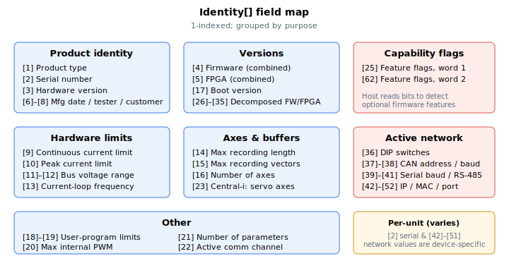

# Identity

Read-only array describing the controller: identification, versions, limits and capability flags.

## Overview

`Identity` is a read-only, 1-indexed array that describes the controller. Host software — notably Agito PCSuite — reads it to identify the unit, detect which features the firmware implements, and adapt its behaviour accordingly. It is non-axis and reflects the live device.

## How it works

The array is populated once at power-up while the controller initialises. Fixed facts about the build and hardware are written directly: the product-type code, the firmware version (and its decomposed major/minor/patch/owner/sub-version fields), the FPGA version (read from an FPGA register and decoded into the same fields), current and bus-voltage limits, the current-loop frequency, the recording-buffer limits, the axis count, the boot version, user-program limits, the parameter count, and the two capability bitfields. Two fields are not known until the serial number has been loaded from flash: `Identity[2]` (serial number) and `Identity[3]` (hardware version) are copied from `ProductSN[2]` and `ProductSN[1]` respectively after the keywords are loaded (and again whenever `ProductSN` is written). Fields that the unit cannot determine are left at an "uninitialised" sentinel value.

A host typically reads `Identity[1]` to learn the model, `Identity[16]` to learn the axis count, and the two feature-flag words to decide which optional behaviours to enable.



## Index reference

| Index | Field | Notes |
|-------|-------|-------|
| [1] | Product type | Numeric product-model code — see table below |
| [2] | Serial number | Production serial number; copied from `ProductSN[2]` at power-up |
| [3] | Hardware version | Hardware revision; copied from `ProductSN[1]` at power-up |
| [4] | Firmware version | Combined firmware version number |
| [5] | FPGA version | Combined FPGA version number |
| [6] | Manufacture date | Uninitialised unless programmed |
| [7] | Tester code | Uninitialised unless programmed |
| [8] | Customer code | Uninitialised unless programmed |
| [9] | Continuous current limit | Hardware continuous-current rating (uninitialised on multi-axis Central-i masters) |
| [10] | Peak current limit | Hardware peak-current rating (uninitialised on multi-axis Central-i masters) |
| [11] | Minimum bus voltage | |
| [12] | Maximum bus voltage | |
| [13] | Current-loop frequency | Samples per second |
| [14] | Maximum recording length | Usable data-recording buffer length |
| [15] | Maximum recording vectors | Number of recordable channels |
| [16] | Number of axes | |
| [17] | Boot version | |
| [18] | User-program maximum threads | |
| [19] | User-program numeric stack depth | |
| [20] | Maximum internal PWM value | PWM timer period |
| [21] | Number of parameters | Count of keywords in the parameter table |
| [22] | Type of communication | Active comm channel (set when a host connects) |
| [23] | Central-i master: number of servo axes | |
| [24] | Analog-inputs update rate | Samples between analog-input filter updates |
| [25] | Feature flags, word 1 | Capability bitfield (see below) |
| [26]–[30] | Firmware version fields | Major, minor, patch, owner, sub-version |
| [31]–[35] | FPGA version fields | Major, minor, patch, owner, sub-version |
| [36] | DIP switches | Packed state of the unit's configuration DIP switches |
| [37]–[38] | Active CAN address / baud rate | |
| [39]–[41] | Active serial baud rates / RS-485 address | Mini-USB RS-232, RJ45 RS-232, RS-485 |
| [42]–[45] | Active Ethernet IP address | Four octets (device-specific) |
| [46]–[51] | Active Ethernet MAC address | Six octets (device-specific) |
| [52] | Active Ethernet port | |
| [53] | FPGA device ID | Identifies the FPGA silicon variant |
| [54] | Product variant | Uninitialised unless applicable |
| [55] | Position-tracking FIFO size | |
| [62] | Feature flags, word 2 | Capability bitfield (see below) |

> Indices [42]–[51] expose the unit's *active* network address. They are read-only reflections of the live configuration and vary per unit; they are not shown here with any real value.

### Version decomposition

Both the firmware version (`Identity[4]`) and the FPGA version (`Identity[5]`) are also exposed broken out into five fields each — major, minor, patch, owner and sub-version — at indices [26]–[30] and [31]–[35]. For the FPGA these are unpacked from a packed version register (major in the top bits, minor in the middle bits, patch in the low bits, with owner and sub-version from a second register). Reading the decomposed fields avoids having to parse the combined number on the host.

### Product-type codes (index 1)

The product type is a small numeric code identifying the model. The codes correspond to the marketing model names below.

| Value | Model |
|-------|-------|
| 5 | AGD200 |
| 9 | AGD155 |
| 10 | AGM800 |
| 11 | AGD301 |
| 12 | AGD155EC |
| 13 | AGD101EC |
| 14 | AGD156EC |

Additional internal type codes exist for non-standard products; the codes above are the ones returned by the standard customer models.

### Feature-flag words (indices 25 and 62)

`Identity[25]` and `Identity[62]` are bitfields in which each bit advertises support for a specific firmware capability. Host software tests these bits to decide which features are available, rather than inferring capability from the firmware version number. Word 1 (`Identity[25]`) carries the bulk of the flags — for example learn-commutation, additional CNC segment features, vector motion mode, true-jerk CNC, smooth auto-phase, dynamic (indirect) array indexing, and Halls-only commutation. Word 2 (`Identity[62]`) carries newer flags as word 1 fills up.

To test a capability, mask the word with the bit for that feature; a non-zero result means the feature is present. Because the bit assignments grow with each release, treat any bit that the running firmware does not set as "not supported".

## Examples

```text
AIdentity[1]        ; product-type code
AIdentity[2]        ; production serial number
AIdentity[16]       ; number of axes
AIdentity[4]        ; combined firmware version
AIdentity[25]       ; feature-flag word 1
```

## Edge cases

- **Motor off / on / in motion.** Read-only; reading is permitted in any state.
- **Power-up ordering.** Most fields are populated during the controller's initialisation pass; `Identity[2]` (serial number) and `Identity[3]` (hardware version) are filled later, after [ProductSN](ProductSN.md) has been loaded from flash. Reading these too early returns the sentinel/uninitialised value.
- **`ProductSN` write.** Writing [ProductSN](ProductSN.md) re-copies `[1]` and `[2]` into `Identity[3]` and `Identity[2]`, so `Identity` stays in sync with the stored value.
- **Central-i disconnect.** `Identity` describes the *master* controller; it is unaffected by any remote-port link state. For the connected remote's identity see [CIIdentity](../05-central-i/CIIdentity.md).
- **Simulation / no remote.** The master's own identification is always present regardless of whether any Central-i port is connected.
- **Uninitialised fields.** Some entries (manufacture date, tester code, customer code, product variant, and on multi-axis Central-i masters the per-channel current ratings) are only populated on units that programmed them; otherwise they read as an "uninitialised" sentinel.

## Changes between versions

On Central-i v5 the array is larger (`array_size` = 75, vs 63 on v4 — see the frontmatter). The additional indices expose extra version information used by the Central-i system: a Central-i master version (decomposed major/minor/patch/owner/sub-version plus a combined value), the actual and expected EtherCAT-slave-information (ESI) version numbers, and the sizes of the firmware's print buffers. Indices [1]–[62] keep the same meaning on both versions.

## See also

- [ProductSN](ProductSN.md) — source of the serial number (`Identity[2]`) and hardware version (`Identity[3]`)
- [FWInfo](FWInfo.md) — firmware version and build-info strings
- [About](About.md) — full parameter dump (Agito PCSuite internal use)
