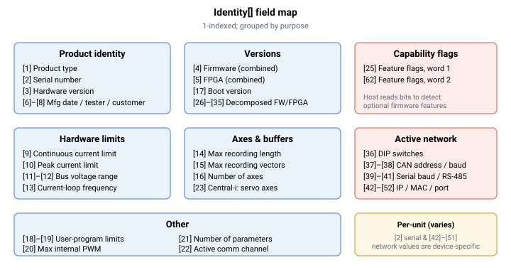

# Identity

只读数组，描述控制器：识别信息、版本、限值与能力标志。

## 概述

`Identity` 是一个只读、1 索引的数组，用于描述控制器。上位机软件——尤其是 Agito PCSuite——读取它以识别单元、检测固件实现了哪些功能，并据此调整自身行为。它为非轴对象，反映实时设备状态。

## 工作原理

该数组在控制器初始化过程中于上电时填充一次。关于构建与硬件的固定事实会被直接写入：产品类型代码、固件版本（及其分解出的主/次/补丁/所有者/子版本字段）、FPGA 版本（从 FPGA 寄存器读取并解码为相同字段）、电流与母线电压限值、电流环频率、记录缓冲区限值、轴数、引导版本、用户程序限值、参数数量，以及两个能力位域。有两个字段在序列号从闪存加载之前无法确定：`Identity[2]`（序列号）和 `Identity[3]`（硬件版本）分别在关键字加载后（以及每次写入 `ProductSN` 时）从 `ProductSN[2]` 和 `ProductSN[1]` 复制而来。单元无法确定的字段将保留为"未初始化"的标记值。

上位机通常读取 `Identity[1]` 以了解型号，读取 `Identity[16]` 以了解轴数，并读取两个功能标志字以决定启用哪些可选行为。



## 索引参考

| Index | 字段 | 说明 |
|-------|-------|-------|
| [1] | 产品类型 | 数值形式的产品型号代码——见下表 |
| [2] | 序列号 | 生产序列号；上电时从 `ProductSN[2]` 复制 |
| [3] | 硬件版本 | 硬件修订版本；上电时从 `ProductSN[1]` 复制 |
| [4] | 固件版本 | 组合固件版本号 |
| [5] | FPGA 版本 | 组合 FPGA 版本号 |
| [6] | 制造日期 | 除非已编程否则未初始化 |
| [7] | 测试员代码 | 除非已编程否则未初始化 |
| [8] | 客户代码 | 除非已编程否则未初始化 |
| [9] | 连续电流限值 | 硬件连续电流额定值（多轴 Central-i 主控上未初始化） |
| [10] | 峰值电流限值 | 硬件峰值电流额定值（多轴 Central-i 主控上未初始化） |
| [11] | 最小母线电压 | |
| [12] | 最大母线电压 | |
| [13] | 电流环频率 | 每秒采样数 |
| [14] | 最大记录长度 | 可用的数据记录缓冲区长度 |
| [15] | 最大记录矢量数 | 可记录通道数 |
| [16] | 轴数 | |
| [17] | 引导版本 | |
| [18] | 用户程序最大线程数 | |
| [19] | 用户程序数值栈深度 | |
| [20] | 最大内部 PWM 值 | PWM 定时器周期 |
| [21] | 参数数量 | 参数表中关键字的数量 |
| [22] | 通信类型 | 活动通信通道（在上位机连接时设置） |
| [23] | Central-i 主控：伺服轴数 | |
| [24] | 模拟量输入更新率 | 模拟量输入滤波器更新之间的采样数 |
| [25] | 功能标志，字 1 | 能力位域（见下文） |
| [26]–[30] | 固件版本字段 | 主、次、补丁、所有者、子版本 |
| [31]–[35] | FPGA 版本字段 | 主、次、补丁、所有者、子版本 |
| [36] | DIP 开关 | 单元配置 DIP 开关的打包状态 |
| [37]–[38] | 活动 CAN 地址 / 波特率 | |
| [39]–[41] | 活动串口波特率 / RS-485 地址 | Mini-USB RS-232、RJ45 RS-232、RS-485 |
| [42]–[45] | 活动以太网 IP 地址 | 四个字节段（因设备而异） |
| [46]–[51] | 活动以太网 MAC 地址 | 六个字节段（因设备而异） |
| [52] | 活动以太网端口 | |
| [53] | FPGA 器件 ID | 标识 FPGA 芯片变体 |
| [54] | 产品变体 | 除非适用否则未初始化 |
| [55] | 位置跟踪 FIFO 大小 | |
| [62] | 功能标志，字 2 | 能力位域（见下文） |

> 索引 [42]–[51] 暴露单元的*活动*网络地址。它们是实时配置的只读反映，因单元而异；此处不展示任何真实值。

### 版本分解

固件版本（`Identity[4]`）和 FPGA 版本（`Identity[5]`）也分别在索引 [26]–[30] 和 [31]–[35] 处拆分为五个字段——主、次、补丁、所有者和子版本。对于 FPGA，这些字段从一个打包版本寄存器中解包而来（主版本位于高位、次版本位于中间位、补丁位于低位，所有者与子版本来自第二个寄存器）。读取分解后的字段可避免在上位机端解析组合数值。

### 产品类型代码（索引 1）

产品类型是一个标识型号的小数值代码。这些代码对应下方的市场型号名称。

| 值 | 型号 |
|-------|-------|
| 5 | AGD200 |
| 9 | AGD155 |
| 10 | AGM800 |
| 11 | AGD301 |
| 12 | AGD155EC |
| 13 | AGD101EC |
| 14 | AGD156EC |

非标准产品还存在额外的内部类型代码；上方代码是标准客户型号返回的代码。

### 功能标志字（索引 25 和 62）

`Identity[25]` 和 `Identity[62]` 是位域，其中每一位标示对某项特定固件能力的支持。上位机软件测试这些位以决定哪些功能可用，而非从固件版本号推断能力。字 1（`Identity[25]`）承载了大部分标志——例如学习换相、附加 CNC 段功能、矢量运动模式、真实急动度 CNC、平滑自动定相、动态（间接）数组索引以及仅霍尔换相。字 2（`Identity[62]`）在字 1 填满时承载较新的标志。

要测试某项能力，用该功能对应的位对该字进行掩码运算；结果非零表示该功能存在。由于位分配随每次发布而增长，应将运行中固件未置位的任何位视为"不支持"。

## 示例

```text
AIdentity[1]        ; product-type code
AIdentity[2]        ; production serial number
AIdentity[16]       ; number of axes
AIdentity[4]        ; combined firmware version
AIdentity[25]       ; feature-flag word 1
```

## 边界情况

- **电机失能 / 使能 / 运动中。** 只读；任何状态下均允许读取。
- **上电顺序。** 大多数字段在控制器初始化过程中填充；`Identity[2]`（序列号）和 `Identity[3]`（硬件版本）在 [ProductSN](ProductSN.md) 从闪存加载之后才填充。过早读取这些字段将返回标记/未初始化值。
- **`ProductSN` 写入。** 写入 [ProductSN](ProductSN.md) 会将 `[1]` 和 `[2]` 重新复制到 `Identity[3]` 和 `Identity[2]`，使 `Identity` 与存储值保持同步。
- **Central-i 断连。** `Identity` 描述的是*主控*控制器；它不受任何远程端口链路状态的影响。关于已连接远程单元的识别信息，请参阅 [CIIdentity](../05-central-i/CIIdentity.md)。
- **仿真 / 无远程单元。** 无论是否连接任何 Central-i 端口，主控自身的识别信息始终存在。
- **未初始化字段。** 部分条目（制造日期、测试员代码、客户代码、产品变体，以及多轴 Central-i 主控上的逐通道电流额定值）仅在已对其编程的单元上填充；否则读取为"未初始化"标记值。

## 版本间差异

在 Central-i v5 上该数组更大（`array_size` = 75，而 v4 上为 63——见前置元数据）。额外的索引暴露 Central-i 系统使用的更多版本信息：一个 Central-i 主控版本（分解出的主/次/补丁/所有者/子版本以及一个组合值）、实际与期望的 EtherCAT 从站信息（ESI）版本号，以及固件打印缓冲区的大小。已记录的索引 [1]–[55] 和 [62] 在两个版本上含义相同。在 Central-i v5 上，[56]–[61] 处出现一些额外的内部字段，上位机软件不使用这些字段，此处也不予记录。

## 另请参阅

- [ProductSN](ProductSN.md) — 序列号（`Identity[2]`）与硬件版本（`Identity[3]`）的来源
- [FWInfo](FWInfo.md) — 固件版本与构建信息字符串
- [About](About.md) — 完整参数转储（Agito PCSuite 内部使用）
