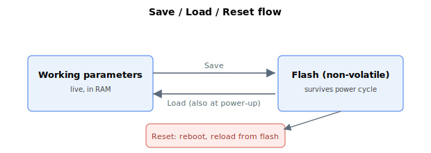

# Operation

**Overview:**

Commands that act on the controller's overall state: saving and loading parameters to and from flash, performing a software reset, entering firmware or FPGA download mode, and auto-starting the user program. Most of these commands cannot be issued while the motor is enabled or in motion.

