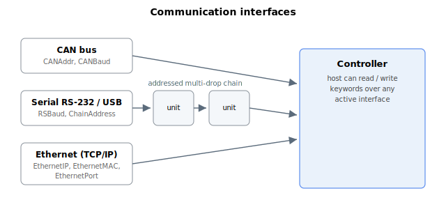

# Communication

**Overview:**

Agito supports communication over CAN Bus (Physical layer only), Ethernet (TCP/IP) and RS-232, USB. The following section briefly describes keywords related to communication.

**Command and reply flow:** A command is processed and its reply is always returned on the same channel it arrived on — a command received on the serial mini-USB port is answered on that port, one received on the RJ45 serial port on that port, one received over CAN on CAN, and one received over Ethernet on Ethernet. Regardless of channel, the four access types are: inquire a scalar, inquire an array element, assign a scalar, and assign an array element.

**Addressed axis comes first:** On every channel the controller reads the target axis from the very first part of the command before it acts on the keyword. Over the serial path this is the leading axis letter; over CAN it is carried in the high bits of the first frame byte (the same axis field that [RemoteCANCCC](RemoteCANCCC.md) packs for a remote access). If that axis is outside the configured range — and is not the special program-chosen axis used inside user programs — the command is rejected with error 2 (illegal axis name in the first letter) and the keyword is never reached. The CAN and serial parsers apply this identical check and return the same error 2, so a bad axis fails the same way on both.

**Error replies are always logged:** When a command produces an error, the controller records that error before it sends the reply. The error code together with a timestamp is written to the error log regardless of which channel the command came in on (serial mini-USB, RJ45 serial, CAN, or Ethernet); an error on a command issued from inside a user program is marked specially in the log. Because logging happens before the reply is routed back to its originating channel, the error is captured even if the host never reads the inline error reply. The most recent communication error code is also retained so it can be reported by later status and report queries.

**CAN frame format:** An incoming CAN command frame must carry 2, 4, 6, or 8 data bytes (the four access types above); any other data length is rejected with error 15. The reply frame is one of:

| Reply | Length | Contents |
|---|---|---|
| OK (assign / function) | 1 byte | `>` |
| Error | 3 bytes | 16-bit error code, then `>` |
| Inquiry value | 5 bytes | 32-bit value, then `>` |

Because the CAN value field is 32 bits, keyword values exchanged over CAN are limited to 32-bit integers. Keywords that hold a 64-bit value (for example a gear master or position reference) cannot be fully transferred over CAN; use the ASCII serial or Ethernet path, which formats the value as text and is not bound by the 32-bit frame field.

**CAN transmit acknowledge and reply timeout:** Before re-using a CAN transmit slot the controller waits for the previous message on that slot to be acknowledged on the bus. If no acknowledge arrives within roughly 1–2 seconds the wait times out and the message is abandoned — for a command reply this means the reply is simply dropped rather than queued, so a host that does not acknowledge will not receive that answer. This per-message acknowledge wait is a separate mechanism from [CANDelay](CANDelay.md): `CANDelay` sets a fixed minimum gap between successive messages for pacing a slow host, whereas the acknowledge wait is a one-shot guard that only blocks when the previous transmit has not yet completed.

**Push-status and replies are flow-controlled independently on CAN:** The controller transmits push-status messages and command replies through two separate CAN transmit slots, each with its own acknowledge gate (see the +1 reply and +15 push-status identifiers in [CANAddr](CANAddr.md)). A stalled push-status stream therefore does not block command replies, and vice versa. On a serial port there is only one outgoing path, so the two cannot run in parallel there: an in-progress push-status transmission takes priority and preempts a pending reply on that single serial port until it completes.

For more information, please refer to communication manual.
