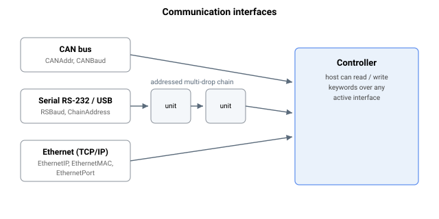

# 通信

**概述：**

Agito 支持通过 CAN 总线（仅物理层）、以太网（TCP/IP）、RS-232 和 USB 进行通信。以下章节简要描述与通信相关的关键字。

**命令与回复流程：** 命令被处理后，其回复始终从它到达的同一通道返回——从串行 mini-USB 端口收到的命令在该端口应答，从 RJ45 串行端口收到的在该端口应答，从 CAN 收到的在 CAN 上应答，从以太网收到的在以太网上应答。无论何种通道，四种访问类型为：查询标量、查询数组元素、赋值标量、赋值数组元素。

**寻址轴优先：** 在每个通道上，控制器在对关键字执行操作之前，先从命令的最开始部分读取目标轴。在串行路径上这是前导的轴字母；在 CAN 上它承载于第一个帧字节的高位中（即 [RemoteCANCCC](RemoteCANCCC.md) 为远程访问打包的同一个轴字段）。如果该轴超出配置范围——且不是用户程序内部使用的特殊程序选定轴——则该命令以错误 2（首字母中的非法轴名）被拒绝，且永远不会到达关键字。CAN 与串行解析器应用这一相同的检查并返回相同的错误 2，因此一个错误的轴在两者上以相同方式失败。

**错误回复始终被记录：** 当命令产生错误时，控制器在发送回复之前先记录该错误。无论命令来自哪个通道（串行 mini-USB、RJ45 串行、CAN 或以太网），错误码连同时间戳都会写入错误日志；从用户程序内部发出的命令上的错误在日志中被特别标记。由于记录发生在回复被路由回其发起通道之前，即使上位机从未读取内联错误回复，该错误也会被捕获。最近一次通信错误码也会被保留，以便后续的状态和报告查询能够报告它。

**CAN 帧格式：** 一个入站 CAN 命令帧必须携带 2、4、6 或 8 个数据字节（即上述四种访问类型）；任何其他数据长度都以错误 15 被拒绝。回复帧为以下之一：

| 回复类型 | 长度 | 内容 |
|---|---|---|
| OK（赋值 / 函数） | 1 byte | `>` |
| 错误 | 3 bytes | 16-bit error code, then `>` |
| 查询值 | 5 bytes | 32-bit value, then `>` |

由于 CAN 值字段为 32 位，通过 CAN 交换的关键字值被限制为 32 位整数。保存 64 位值的关键字（例如齿轮主轴或位置参考）无法通过 CAN 完整传输；请使用 ASCII 串行或以太网路径，它们将值格式化为文本，不受 32 位帧字段的约束。

**CAN 发送确认与回复超时：** 在重新使用一个 CAN 发送槽之前，控制器会等待该槽上的前一条消息在总线上被确认。如果在大约 1–2 秒内没有确认到达，则等待超时并放弃该消息——对于命令回复，这意味着回复被直接丢弃而不是排队，因此一个不进行确认的上位机将收不到该应答。这种逐消息确认等待与 [CANDelay](CANDelay.md) 是独立的机制：`CANDelay` 设置连续消息之间的固定最小间隔以适配慢速上位机，而确认等待是一种一次性保护，仅在前一次发送尚未完成时才阻塞。

**推送状态与回复在 CAN 上独立进行流控：** 控制器通过两个独立的 CAN 发送槽传输推送状态消息和命令回复，每个槽都有各自的确认门控（见 [CANAddr](CANAddr.md) 中的 +1 回复标识符和 +15 推送状态标识符）。因此，停滞的推送状态流不会阻塞命令回复，反之亦然。在串行端口上只有一条出站路径，所以两者无法在此并行：正在进行的推送状态传输具有优先权，并在该单一串行端口上抢占待处理的回复，直到其完成。

更多信息请参阅通信手册。
