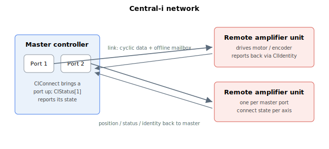

# Central-i

**Overview:**

Keywords for the **Central-i** link — Agito's high-speed interface between a controller and Central-i devices.

The subsystem covers:

- **Connection** — bringing the link up and down (`CIConnect`, `CIAutoConnect`, `CIDisconnect`).
- **Configuration** — port role, physical/protocol settings, and the synchronous data map (`CIDeviceType`, `CILinkConfig`, `CISyncDef`).
- **Status** — live link state per axis and system-wide, and connected-device identity (`CIStatus`, `CIGlobalStat`, `CIIdentity`).
- **Multiplexer** — sharing one Central-i interface across ports (`CiMuxDir`, `CiMuxSel`).
- **Offline data & logging** — pre-loading/simulating device data and reading captured logs (`CIOfflineDef`, `CIOfflineData`, `CIOfflineSend`, `OfflineALog`, `OfflineBLog`).

Configure a port (device type and link settings) before connecting; once connected, status and device identity are populated automatically.
