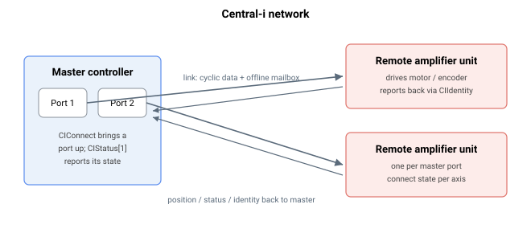

# Central-i

**概述：**

**Central-i** 链路相关关键字 —— Agito 在控制器与 Central-i 设备之间的高速接口。

该子系统涵盖：

- **连接** —— 建立与断开链路（`CIConnect`、`CIAutoConnect`、`CIDisconnect`）。
- **配置** —— 端口角色、物理/协议设置以及同步数据映射（`CIDeviceType`、`CILinkConfig`、`CISyncDef`）。
- **状态** —— 每轴及系统级的实时链路状态，以及已连接设备的标识（`CIStatus`、`CIGlobalStat`、`CIIdentity`）。
- **多路复用器** —— 在多个端口间共享一个 Central-i 接口（`CiMuxDir`、`CiMuxSel`）。
- **离线数据与日志** —— 预加载/仿真设备数据并读取捕获的日志（`CIOfflineDef`、`CIOfflineData`、`CIOfflineSend`、`OfflineALog`、`OfflineBLog`）。

在连接之前先配置端口（设备类型与链路设置）；一旦连接成功，状态与设备标识将自动填充。
