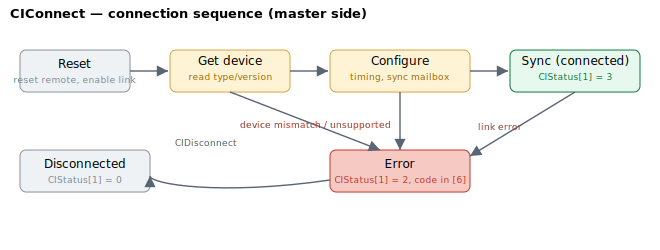

# CIConnect

Command that initiates a Central-i link on the selected axis port.

## Overview

`CIConnect` starts the Central-i connection sequence on the selected axis port. Central-i is the multi-axis network in which a master controller talks to one remote unit (amplifier or I/O unit) per port over a serial link. `CIConnect` brings that link up: the master resets the remote, reads back its device type and version, configures the link timing and the synchronous mailbox, and finally enters the synchronised, cyclic data-exchange state.

Configure the port first — the expected device role ([CIDeviceType](CIDeviceType.md)) and the link timing ([CILinkConfig](CILinkConfig.md)) — then issue `CIConnect`. It is a function keyword (it takes no value) and cannot be run while the motor is on or in motion. After a successful connection [CIIdentity](CIIdentity.md) is populated, the port's bit in [CIGlobalStat](CIGlobalStat.md) is set, and [CIStatus](CIStatus.md) reports the live link; on failure [CIStatus](CIStatus.md) shows the fault state and an error code.

## How it works

`CIConnect` does not block until the link is up. It validates the request, then arms a per-port state machine that the firmware advances in the background: one connection step is taken per background pass until the port reaches connected (`CIStatus[1] = 3`) or fault (`2`), at which point the request is cleared. (The live, per-cycle synchronous data exchange runs separately, in the control interrupt, only once the port is connected.) At power-up the same sequence is instead driven to completion in a tight loop, because the background loop and control interrupt are not yet running — see *Power-up* under [Edge cases](#edge-cases). The reported state is visible in `CIStatus[1]` — see [CIStatus](CIStatus.md) for the full state table.

When a port reaches the connected state the firmware re-applies any per-device special parameters and opens a short settling window (about 150 control cycles) before relying on the remote's front-end, so the first readings stabilise before the link is treated as fully live.



The sequence is:

1. **Reset** — the master pulses the remote reset, enables the link, sets the default channel bit-rate and the offline mailbox sizes, and clears stale mailbox status. `CIStatus[1]` becomes `1` (in process) and the port's connected bit in [CIGlobalStat](CIGlobalStat.md) is cleared.
2. **Get device** — the master queries the remote's Central-i engine version, product type/sub-type, and application/FPGA version through offline (mailbox) messages, filling [CIIdentity](CIIdentity.md).
3. **Verify** — the engine version and device type are checked against [CIDeviceType](CIDeviceType.md). A mismatch, an unsupported engine version, or an `AmpType` that does not match the device class stops the sequence with an error (see the error-code table in [CIStatus](CIStatus.md)).
4. **Configure** — link timing from [CILinkConfig](CILinkConfig.md) is written to the port and the synchronous mailbox is set up for cyclic exchange.
5. **Sync** — the link enters synchronised operation: `CIStatus[1]` becomes `3` (connected) and per-cycle data is exchanged.

`CIConnect` rejects the request up front (returning an error, without changing state) when the port is already connected, when an amplifier device type is requested on a port that cannot drive a motor, or when the configured [CIDeviceType](CIDeviceType.md) class is incompatible with the axis's `AmpType`.

A simulation device type (see [CIDeviceType](CIDeviceType.md)) skips the physical sequence: the port is marked connected immediately, [CIIdentity](CIIdentity.md) is filled with default channel counts so tools show a plausible interface, and the port's connected bit is set in [CIGlobalStat](CIGlobalStat.md).

## Examples

```text
ACIConnect           ; bring up the Central-i link on the selected axis
ACIStatus[1]         ; then poll: 1 = in process, 3 = connected, 2 = fault
```

### Walk-through: connect a Central-i unit

Bring up the link, poll until it is connected (or report the fault), then confirm the remote device matches what you expected.

```text
ACIDeviceType=...    ; (one-time) configure the expected device class for this port
ACILinkConfig=...    ; (one-time) configure the link timing for this port
                     ; both must be saved to flash if you want them to persist
ACIConnect           ; arm the connect sequence (motor must be off)
ACIStatus[1]         ; poll: 1 = in process; loop until it leaves 1
                     ; then check the result
ACIStatus[1]         ; expect 3 = connected
                     ; if it is 2 (fault):
ACIStatus[6]         ;   read the last error code (see CIStatus table)
ACIStatus[5]         ;   time of the last error (seconds since power-on)
                     ; on success, confirm the remote identity
ACIIdentity[1]       ; device class (matches CIDeviceType)
ACIIdentity[2]       ; device sub-type
ACIIdentity[5]       ; digital input count reported by the remote
ACIGlobalStat        ; the port's connected bit is now set in the system-wide summary
```

Common failures: `CIStatus[6] = 9` means the remote does not match `CIDeviceType`; `11`/`13`/`14` mean the remote needs a specific `AmpType`; `6` flags an unsupported Central-i engine version. For an automatic version of this sequence at power-up, set [CIAutoConnect](CIAutoConnect.md).

## Edge cases

- **Motor on / in motion.** Rejected — `CIConnect` cannot be issued while the motor is enabled or moving. Stop the axis and disable the motor first.
- **Already connected.** Rejected up front (no state change) — disconnect with [CIDisconnect](CIDisconnect.md) before reconnecting.
- **Power-up.** When [CIAutoConnect](CIAutoConnect.md) is set for a port the firmware runs this same sequence during start-up, driving the state machine in a tight loop because interrupts are not yet active. The host can poll [CIStatus](CIStatus.md) afterwards.
- **Standalone product.** Central-i is the master-side feature; on a standalone controller there are no Central-i ports to connect, so the keyword has no effect there. v5 firmware is central-i only.
- **Simulation device type.** With [CIDeviceType](CIDeviceType.md) set to a simulation class the physical reset/get-device/configure phases are skipped: the port is marked connected immediately, [CIIdentity](CIIdentity.md) is filled with default channel counts, and the port's connected bit is set in [CIGlobalStat](CIGlobalStat.md). The [CIGlobalStat](CIGlobalStat.md) simulation (high) bit is not set by connect; that bit is governed by [MotorType](../../02-motor-and-amplifier/MotorType.md) = simulation.
- **Device-type mismatch with axis.** Requesting an amplifier class on a port that cannot drive a motor, or a class incompatible with the axis's `AmpType`, is rejected before the sequence starts — [CIStatus](CIStatus.md)`[6]` carries the specific error code (9, 11, 13, or 14).

## See also

- [CIAutoConnect](CIAutoConnect.md) — run this sequence automatically at power-up
- [CIDisconnect](CIDisconnect.md) — tear down the link
- [CIDeviceType](CIDeviceType.md) / [CILinkConfig](CILinkConfig.md) — port configuration applied during connect
- [CIStatus](CIStatus.md) — per-axis state machine and error codes
- [CIGlobalStat](CIGlobalStat.md) — system-wide connection summary
- [CIIdentity](CIIdentity.md) — device identity populated on connect
