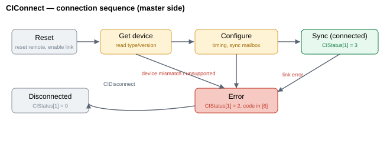

# CIConnect

在所选轴端口上发起 Central-i 链路的命令。

## 概述

`CIConnect` 在所选轴端口上启动 Central-i 连接序列。Central-i 是一种多轴网络，主控制器在其中通过串行链路与每个端口上的一个远程单元（驱动器或 I/O 单元）通信。`CIConnect` 建立该链路：主机复位远程单元，回读其设备类型与版本，配置链路时序与同步邮箱，最终进入同步的周期数据交换状态。

请先配置端口 —— 期望的设备角色（[CIDeviceType](CIDeviceType.md)）与链路时序（[CILinkConfig](CILinkConfig.md)）—— 再发出 `CIConnect`。它是一个函数型关键字（不取值），不能在电机使能或运动中运行。连接成功后，[CIIdentity](CIIdentity.md) 被填充，该端口在 [CIGlobalStat](CIGlobalStat.md) 中的位被置位，[CIStatus](CIStatus.md) 报告实时链路；失败时 [CIStatus](CIStatus.md) 显示故障状态及错误码。

## 工作原理

`CIConnect` 不会阻塞直至链路建立。它先验证请求，然后置位一个每端口状态机，由固件在后台推进：每个后台轮次执行一个连接步骤，直至端口达到已连接（`CIStatus[1] = 3`）或故障（`2`），此时请求被清除。（实时的、每周期的同步数据交换单独运行于控制中断中，仅在端口连接后才执行。）在上电时，由于后台循环和控制中断尚未运行，相同序列改为在一个紧凑循环中驱动至完成 —— 参见 [边缘情况](#边缘情况) 下的 *上电*。所报告的状态可在 `CIStatus[1]` 中查看 —— 完整状态表参见 [CIStatus](CIStatus.md)。

当端口达到已连接状态时，固件会重新应用任何每设备特殊参数，并打开一个短暂的稳定窗口（约 150 个控制周期），之后才依赖远程单元的前端，使首批读数在链路被视为完全可用之前稳定下来。



序列如下：

1. **复位** —— 主机脉冲触发远程复位，使能链路，设置默认通道波特率和离线邮箱大小，并清除陈旧的邮箱状态。`CIStatus[1]` 变为 `1`（处理中），该端口在 [CIGlobalStat](CIGlobalStat.md) 中的已连接位被清除。
2. **获取设备** —— 主机通过离线（邮箱）消息查询远程单元的 Central-i 引擎版本、产品类型/子类型及应用/FPGA 版本，填充 [CIIdentity](CIIdentity.md)。
3. **校验** —— 引擎版本和设备类型对照 [CIDeviceType](CIDeviceType.md) 进行检查。若不匹配、引擎版本不受支持，或 `AmpType` 与设备类别不符，则序列以错误终止（参见 [CIStatus](CIStatus.md) 中的错误码表）。
4. **配置** —— 来自 [CILinkConfig](CILinkConfig.md) 的链路时序被写入端口，并为周期交换设置同步邮箱。
5. **同步** —— 链路进入同步运行：`CIStatus[1]` 变为 `3`（已连接），并交换每周期数据。

当端口已连接、当在无法驱动电机的端口上请求驱动器设备类型、或当所配置的 [CIDeviceType](CIDeviceType.md) 类别与轴的 `AmpType` 不兼容时，`CIConnect` 会预先拒绝该请求（返回错误，不改变状态）。

仿真设备类型（参见 [CIDeviceType](CIDeviceType.md)）会跳过物理序列：端口立即标记为已连接，[CIIdentity](CIIdentity.md) 以默认通道计数填充以便工具显示一个合理的接口，并在 [CIGlobalStat](CIGlobalStat.md) 中置位该端口的已连接位。

## 示例

```text
ACIConnect           ; bring up the Central-i link on the selected axis
ACIStatus[1]         ; then poll: 1 = in process, 3 = connected, 2 = fault
```

### 演练：连接一个 Central-i 单元

建立链路，轮询直至其连接（或报告故障），然后确认远程设备与你的预期一致。

```text
ACIDeviceType=...    ; (one-time) configure the expected device class for this port
ACILinkConfig=...    ; (one-time) configure the link timing for this port
                     ; both must be saved to flash if you want them to persist
ACIConnect           ; arm the connect sequence (motor must be off)
ACIStatus[1]         ; poll: 1 = in process; loop until it leaves 1
                     ; then check the result
ACIStatus[1]         ; expect 3 = connected
                     ; if it is 2 (fault):
ACIStatus[6]         ;   read the last error code (see CIStatus table)
ACIStatus[5]         ;   time of the last error (seconds since power-on)
                     ; on success, confirm the remote identity
ACIIdentity[1]       ; device class (matches CIDeviceType)
ACIIdentity[2]       ; device sub-type
ACIIdentity[5]       ; digital input count reported by the remote
ACIGlobalStat        ; the port's connected bit is now set in the system-wide summary
```

常见失败：`CIStatus[6] = 9` 表示远程单元与 `CIDeviceType` 不匹配；`11`/`13`/`14` 表示远程单元需要特定的 `AmpType`；`6` 表示 Central-i 引擎版本不受支持。若需在上电时自动执行此序列，请设置 [CIAutoConnect](CIAutoConnect.md)。

## 边缘情况

- **电机使能 / 运动中。** 被拒绝 —— 在电机使能或运动时无法发出 `CIConnect`。请先停止轴并禁用电机。
- **已连接。** 预先被拒绝（命令错误 `158`，状态不变）—— 在重新连接前先用 [CIDisconnect](CIDisconnect.md) 断开。
- **FPGA 故障。** 如果控制器已标记内部 FPGA 故障，`CIConnect` 会在所有其他检查之前被预先拒绝，返回错误 `244`（"A faulty FPGA has been detected"），状态机和 [CIStatus](CIStatus.md) 均不改变。
- **上电。** 当某端口设置了 [CIAutoConnect](CIAutoConnect.md) 时，固件会在启动期间运行此相同序列，由于中断尚未激活，在一个紧凑循环中驱动状态机。上位机可在之后轮询 [CIStatus](CIStatus.md)。
- **独立产品。** Central-i 是主机侧特性；在独立控制器上没有可连接的 Central-i 端口，因此该关键字在此处无效。v5 固件仅支持 central-i。
- **仿真设备类型。** 当 [CIDeviceType](CIDeviceType.md) 设为某仿真类别时，物理的复位/获取设备/配置阶段被跳过：端口立即标记为已连接，[CIIdentity](CIIdentity.md) 以默认通道计数填充，并在 [CIGlobalStat](CIGlobalStat.md) 中置位该端口的已连接位。[CIGlobalStat](CIGlobalStat.md) 的仿真（高）位不会因连接而被置位；该位由 [MotorType](../../02-motor-and-amplifier/MotorType.md) = simulation 控制。
- **设备类型与轴不匹配。** 在无法驱动电机的端口上请求驱动器类别（命令错误 `170`），或请求其子类型与轴的 `AmpType` 不兼容的驱动器类别 `CIDeviceType`（命令错误 `216`），都会在序列开始前被拒绝：该关键字直接返回命令错误，状态机和 [CIStatus](CIStatus.md) 保持不变。若设备/`AmpType` 不匹配是在连接序列*进行中*被检测到，则会使端口故障，并在 [CIStatus](CIStatus.md)`[6]` 中记录具体的代码（9、11、13 或 14）。

## 另请参阅

- [CIAutoConnect](CIAutoConnect.md) —— 在上电时自动运行此序列
- [CIDisconnect](CIDisconnect.md) —— 断开链路
- [CIDeviceType](CIDeviceType.md) / [CILinkConfig](CILinkConfig.md) —— 连接期间应用的端口配置
- [CIStatus](CIStatus.md) —— 每轴状态机与错误码
- [CIGlobalStat](CIGlobalStat.md) —— 系统级连接汇总
- [CIIdentity](CIIdentity.md) —— 连接时填充的设备标识
