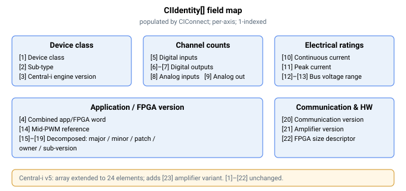

# CIIdentity

由已连接的 Central-i 设备返回的每轴身份信息数组。

## 概述

`CIIdentity` 是一个只读、轴相关数组，保存已连接的 Central-i 设备向主控制器报告的身份和能力信息。主控制器在 [CIConnect](CIConnect.md)（以及 [CIAutoConnect](CIAutoConnect.md)）的“获取设备”阶段填充该数组；在成功连接之前其内容没有意义，而 [CIDisconnect](CIDisconnect.md) 会清除它。它不保存至闪存。索引 `[0]` 未使用，因此有效字段从索引 `[1]` 开始。

## 工作原理

这些元素描述远程单元的类别、固件/FPGA 版本、通道数量（它具有多少个数字和模拟输入/输出）以及关键电气额定值。Agito PCSuite 等工具读取这些信息，以便为已连接设备呈现正确的接口并对其 I/O 进行缩放。



| Index | Field | Meaning |
|-------|-------|---------|
| [1] | Device class | 报告的远程类别（amplifier / I/O / simulation）——见 [CIDeviceType](CIDeviceType.md) |
| [2] | Device sub-type | 类别内的特定设备变体 |
| [3] | Central-i engine version | 远程中的协议引擎版本 |
| [4] | Application / FPGA version | 远程应用/FPGA 版本字 |
| [5] | Digital inputs | 数字量输入通道数量 |
| [6] | Digital outputs | 数字量输出通道数量 |
| [7] | Isolated digital outputs | 隔离数字量输出通道数量 |
| [8] | Analog inputs | 模拟量输入通道数量 |
| [9] | Analog outputs | 模拟量输出通道数量 |
| [10] | Continuous-current rating | 设备支持的最大连续电流 |
| [11] | Peak-current rating | 设备支持的最大峰值电流 |
| [12] | Minimum bus voltage | 设备的母线电压下限 |
| [13] | Maximum bus voltage | 设备的母线电压上限 |
| [14] | Mid-PWM value | 设备 PWM 中点参考 |
| [15] | App/FPGA version — major | 结构化版本：主版本号 |
| [16] | App/FPGA version — minor | 结构化版本：次版本号 |
| [17] | App/FPGA version — patch | 结构化版本：修订号 |
| [18] | App/FPGA version — owner | 结构化版本：构建所有者字段 |
| [19] | App/FPGA version — sub-version | 结构化版本：子版本号 |
| [20] | Communication version | 远程通信层版本 |
| [21] | Amplifier version | 驱动器固件版本 |
| [22] | FPGA size | 远程 FPGA 大小描述符 |

对于**仿真**设备类型，主控制器不读取真实远程设备；相反，它写入默认通道数量（元素 [5]–[9]），以便上位机仍能看到合理的接口。

设备的序列号、日期代码和详细的每通道电气校准会单独读取到固件的内部设备表中（不通过此数组暴露）；`CIIdentity` 承载上述汇总字段。

## 示例

```text
ACIIdentity[1]      ; device class reported by the connected device
ACIIdentity[5]      ; number of digital inputs on the remote
ACIIdentity[8]      ; number of analog inputs on the remote
```

## 边界情况

- **电机失能/使能/运动中。** 只读；任何电机状态下均允许读取。
- **连接前/[CIDisconnect](CIDisconnect.md) 之后。** 内容被清零且没有意义——在依赖该数组之前，请等待 [CIStatus](CIStatus.md)`[1] = 3`。
- **仿真设备。** 当 [CIDeviceType](CIDeviceType.md) 选择仿真类别时，不读取真实远程设备；主控制器将默认通道数量写入 `[5]`–`[9]`，以便上位机工具仍能看到合理的接口，其余电气/版本字段保持为零。
- **独立产品。** Central-i 是主控制器端的功能；在独立控制器上没有可识别的远程设备。
- **以不同设备重新连接。** 在已连接时更改 [CIDeviceType](CIDeviceType.md) 会强制断开，从而清除 `CIIdentity`；新身份会在下一次 [CIConnect](CIConnect.md) 到达*获取设备*阶段时填充。

## 版本间变更

v5（仅 Central-i 的 64 位固件）将数组扩展为 24 个元素，新增一个字段：

| Index | Field | Meaning |
|-------|-------|---------|
| [23] | Amplifier variant | 驱动器硬件变体描述符 |

元素 [1]–[22] 相对 v4 未变更。

## 另见

- [CIConnect](CIConnect.md) — 连接时填充此数组
- [CIDisconnect](CIDisconnect.md) — 清除此数组
- [CIStatus](CIStatus.md) — 活动链路状态
- [CIDeviceType](CIDeviceType.md) — 本地配置的（期望的）端口类别
