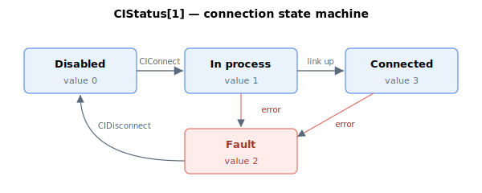

# CIStatus

Per-axis array reporting the live Central-i port state, error counters, and last-error details.

## Overview

`CIStatus` is a read-only, axis-related array (7 usable elements, indices 1–7) that reports the live state of the Central-i port on the selected axis: its connection state, per-channel error counters, the time and code of the last error, and the port frequency. It is updated in real time. For a one-value summary across all ports use [CIGlobalStat](CIGlobalStat.md); for the connected device's identity use [CIIdentity](CIIdentity.md).

## Element map

| Index | Field | Meaning |
|-------|-------|---------|
| [1] | State machine | Connection state — see the state table below |
| [2] | Mailbox-1 error count | Number of mailbox-1 (asynchronous) errors |
| [3] | Mailbox-2 error count | Number of mailbox-2 (asynchronous) errors |
| [4] | Sync error count | Number of synchronous-message (per-cycle) errors |
| [5] | Last error time | Time of the last error (seconds since power-on, cf. [Time](../03-timing/Time.md)) |
| [6] | Last error code | Code of the last error — see the error-code table below |
| [7] | Port frequency | Central-i port frequency |

### Connection state — `CIStatus[1]`



| Value | State | Meaning |
|-------|-------|---------|
| 0 | Disabled | Port not connected (initial / after [CIDisconnect](CIDisconnect.md)) |
| 1 | In process | Connection is being established (after [CIConnect](CIConnect.md)) |
| 2 | Fault | A link error occurred — see `CIStatus[6]` |
| 3 | Connected | Link is up and exchanging data |

### Last error code — `CIStatus[6]`

| Code | Meaning |
|------|---------|
| 1 | CRC error in the first part of the synchronous message |
| 2 | CRC error in the second part of the synchronous message |
| 3 | Synchronous message not sent |
| 4 | Synchronous error timeout |
| 5 | Offline message error |
| 6 | Unexpected Central-i engine version |
| 7 | Device type not supported (contact Agito) |
| 8 | Offline message timeout |
| 9 | Device differs from the one declared in [CIDeviceType](CIDeviceType.md) |
| 10 | Error reading index from device |
| 11 | Adapter requires `AmpType` = analog |
| 12 | Device read from E² differs from FPGA (contact Agito) |
| 13 | Adapter requires `AmpType` = PWM |
| 14 | Adapter requires `AmpType` = linear-remote |

## Examples

```text
ACIStatus[1]                   ; connection state (3 = connected)
ACIStatus[6]                   ; last error code (see table)
ACIStatus[4]                   ; count of synchronous-message errors
```

## See also

- [CIGlobalStat](CIGlobalStat.md) — system-wide connection summary
- [CIIdentity](CIIdentity.md) — connected device identity
- [CIConnect](CIConnect.md) / [CIDisconnect](CIDisconnect.md) — drive the state machine
- [CIDeviceType](CIDeviceType.md) — expected device (error code 9)
