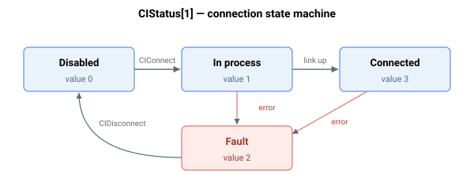

# CIStatus

报告 Central-i 端口实时状态、错误计数器及最后错误详情的轴级数组。

## 概述

`CIStatus` 是一个只读的轴相关数组（7 个可用元素，索引 1–7），报告所选轴上 Central-i 端口的实时状态：其连接状态、各通道的错误计数器、最后错误的时间和错误码，以及端口频率。它实时更新。若需跨所有端口的单值汇总，请使用 [CIGlobalStat](CIGlobalStat.md)；若需所连接设备的标识，请使用 [CIIdentity](CIIdentity.md)。

## 元素映射

| 索引 | 字段 | 含义 |
|-------|-------|---------|
| [1] | 状态机 | 连接状态——见下方状态表 |
| [2] | Mailbox-1 错误计数 | 优先级（固件驱动）离线通道的错误计数器。该通道目前未被使用，因此该计数只会被清除并始终读为 `0` |
| [3] | 离线错误计数 | 离线（非周期）通道的错误计数器：连接序列故障（码 5–14）、一次失败的离线消息发送（码 5），以及来自远程的失败后台读取（码 10） |
| [4] | 同步错误计数 | 同步消息（每周期）错误的数量（码 1–4） |
| [5] | 最后错误时间 | 最后一次错误的时间（自上电起的秒数，参见 [Time](../03-timing/Time.md)） |
| [6] | 最后错误码 | 最后一次错误的错误码——见下方错误码表 |
| [7] | 端口频率 | Central-i 通道比特率，单位 MHz（默认 `10`） |

### 连接状态 — `CIStatus[1]`



| 值 | 状态 | 含义 |
|-------|-------|---------|
| 0 | Disabled | 端口未连接（初始 / 在 [CIDisconnect](CIDisconnect.md) 之后） |
| 1 | In process | 正在建立连接（在 [CIConnect](CIConnect.md) 之后） |
| 2 | Fault | 发生了链路错误——见 `CIStatus[6]` |
| 3 | Connected | 链路已上线并正在交换数据 |

### 最后错误码 — `CIStatus[6]`

| 码 | 含义 |
|------|---------|
| 1 | 同步消息第一部分的 CRC 错误 |
| 2 | 同步消息第二部分的 CRC 错误 |
| 3 | 同步消息未发送 |
| 4 | 同步错误超时 |
| 5 | 离线消息错误 |
| 6 | 意外的 Central-i 引擎版本 |
| 7 | 不支持的设备类型（请联系 Agito） |
| 8 | 离线消息超时 |
| 9 | 设备与 [CIDeviceType](CIDeviceType.md) 中声明的不一致 |
| 10 | 从设备读取索引出错 |
| 11 | 适配器要求 `AmpType` = analog |
| 12 | 从 E² 读取的设备与 FPGA 不一致（请联系 Agito） |
| 13 | 驱动器要求 `AmpType` = built-in PWM |
| 14 | 适配器要求 `AmpType` = linear-remote |

### 何种情况会置入故障状态

当未能及时收到来自远程的每周期同步回复时，已连接的端口会离开状态 `3` 并进入状态 `2`（故障）。固件将此视为链路丢失：它以控制器故障 [ConFlt](../../07-status-and-faults/ConFlt.md) = 1043 关闭电机，在 [CIGlobalStat](CIGlobalStat.md) 中清除该端口的已连接位，撤销发往远程的电机使能命令，并将驱动器输出驱至其中点（零转矩）值。`CIStatus[4]`（同步错误计数）递增，`CIStatus[5]` 记录时间，`CIStatus[6]` 被置为 `4`（同步错误超时）。

其他同步错误——第一部分 CRC（`CIStatus[6] = 1`）、第二部分 CRC（`CIStatus[6] = 2`）以及消息未发送（`CIStatus[6] = 3`）——仅在 `CIStatus[4]` 中计数并记录于 `CIStatus[5]`/`[6]`；它们本身不会使轴故障，链路继续运行。连接后最初几个控制周期内的同步错误会被忽略（固件在最初 4 个周期内抑制它们）。

当一次 [CIConnect](CIConnect.md) 尝试在连接序列期间失败时，也会进入状态 `2`。任何一个设置错误码（`CIStatus[6]` = 5、6、7、8、9、11、12、13、14）都会使端口停留于状态 `2`，递增离线错误计数 `CIStatus[3]`，并将时间和错误码记录到 `CIStatus[5]`/`[6]`，同时清除 [CIGlobalStat](CIGlobalStat.md) 中该端口的已连接位。由于链路从未上线，此情况**不会**引发控制器故障 [ConFlt](../../07-status-and-faults/ConFlt.md) = 1043，也不会关闭电机——该响应专门针对丢失一条已连接的链路（同步超时，`CIStatus[6] = 4`）。

## 示例

```text
ACIStatus[1]                   ; connection state (3 = connected)
ACIStatus[6]                   ; last error code (see table)
ACIStatus[4]                   ; count of synchronous-message errors
```

## 边界情况

- **电机失能 / 电机使能 / 运动中。** `CIStatus` 为只读且始终更新——无论电机状态如何，该关键字都反映实时链路。
- **在 [CIDisconnect](CIDisconnect.md) 之后。** 所有报告的元素都清零为 `0`：状态机读为 `0`（disabled），三个错误计数复位，最后错误字段清零。
- **上电。** 每个端口的初始状态为 `0`（disabled）；[CIAutoConnect](CIAutoConnect.md) 会在启动期间将端口驱至 `1`（in process）再到 `3`（connected）。在端口连接之前，[CIIdentity](CIIdentity.md) 同样无意义。
- **仿真设备。** 当 [CIDeviceType](CIDeviceType.md) 设为仿真类时，端口在 [CIConnect](CIConnect.md) 时直接跳到 `3`（connected）——错误计数器保持为零，因为并无真实帧交换。
- **独立式产品。** Central-i 端口在独立式硬件上不存在；该关键字在那里没有有意义的读数。v5 固件仅为 central-i，因此 `CIStatus` 在 v5 中始终相关。

## 另请参阅

- [CIGlobalStat](CIGlobalStat.md) — 系统级连接汇总
- [CIIdentity](CIIdentity.md) — 所连接设备的标识
- [CIConnect](CIConnect.md) / [CIDisconnect](CIDisconnect.md) — 驱动状态机
- [CIDeviceType](CIDeviceType.md) — 期望设备（错误码 9）
