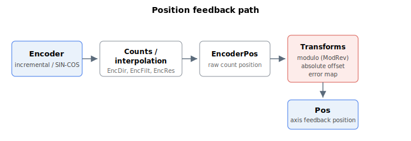

# Encoder

This category groups the keywords that configure and read the axis position feedback and the related signal interfaces. Some products support a main encoder and an auxiliary encoder per axis; the auxiliary-encoder keywords carry an additional `Aux` prefix and behave like their main-encoder counterparts.

The keywords are organised into the following sub-sections:

- **General settings** — feedback type and decoding, direction, input filtering, resolution, user-unit scaling, absolute-encoder configuration, and SIN/COS setup. See the [general-settings overview](01-general-settings/00-overview.md).
- **Index detection** — capture of the encoder index (reference mark) position and status, used in homing. See the [index-detection overview](02-index-detection/00-overview.md).
- **Event-based feedback logging** — latch the feedback position on a digital event, with history tables. See the [event-based feedback logging overview](03-event-based-feedback-logging/00-overview.md).
- **Modulo mode** — wrap the feedback (and references) within a configurable range for endless rotary motion. See the [modulo-mode overview](04-modulo-mode/00-overview.md).
- **Encoder emulation** — emit an A/B/Z quadrature signal derived from the axis feedback for a downstream device. See the [encoder-emulation overview](05-encoder-emulation/00-overview.md).
- **Virtual encoder** — a software-driven signal generator that emits a quadrature or pulse/direction output tracking a selectable source. See the [virtual-encoder overview](06-virtual-encoder/00-overview.md).
- **Absolute encoder** — register read/write transactions to a serial absolute encoder's on-board memory. See the absolute-encoder keywords below.

## General settings

| Keyword | Summary |
|---|---|
| [EncType/AuxEncType](01-general-settings/EncType-AuxEncType.md) | Selects the encoder feedback type (incremental, SIN/COS, absolute, or analog). |
| [EncSubType/AuxEncSubType](01-general-settings/EncSubType-AuxEncSubType.md) | Selects the digital incremental encoder subtype (AqB, pulse-direction, C0/C1, up/down). |
| [EncDir/AuxEncDir](01-general-settings/EncDir-AuxEncDir.md) | Sets the counting direction of the encoder feedback. |
| [EncFilt/AuxEncFilt](01-general-settings/EncFilt-AuxEncFilt.md) | Digital filter applied to the incremental encoder A/B/Z input channels. |
| [EncRes](01-general-settings/EncRes.md) | Encoder resolution; counts per magnetic pitch (linear) or per revolution (rotary). |
| [UsrUnits/AuxUsrUnits](01-general-settings/UsrUnits-AuxUsrUnits.md) | Ratio between a user unit and encoder counts for reading position and its derivatives. |
| [EncAbsBits/AuxEncAbsBits](01-general-settings/EncAbsBits-AuxEncAbsBits.md) | Number of bits of the absolute encoder reading. |
| [EncAbsMB/AuxEncAbsMB](01-general-settings/EncAbsMB-AuxEncAbsMB.md) | Number of least significant bits removed from the absolute encoder reading. |
| [EncAbsOff/AuxEncAbsOff](01-general-settings/EncAbsOff-AuxEncAbsOff.md) | Offset added to the absolute encoder reading at power-up. |
| [EncAbsVal/AuxEncAbsVal](01-general-settings/EncAbsVal-AuxEncAbsVal.md) | Raw absolute encoder value after bit-masking and direction handling. |
| [EncAbsFL/EncAbsRL](01-general-settings/EncAbsFL-EncAbsRL.md) | Forward/reverse limits that re-interpret an out-of-range absolute position at power-on (customized firmware only). |
| [AuxModRev](01-general-settings/AuxModRev.md) | Modulo revolution divisor for the auxiliary encoder (not implemented in current firmware). |
| [SinCosSetup/AuxSinCosSet](01-general-settings/SinCosSetup-AuxSinCosSet.md) | Parameter array configuring the SIN/COS encoder. |
| [SinCosSignals/AuxSinCosSig](01-general-settings/SinCosSignals-AuxSinCosSig.md) | Read-only array reporting the status of the SIN/COS signal interpolation. |

## Index detection

| Keyword | Summary |
|---|---|
| [IndexPos/AuxIndexPos](02-index-detection/IndexPos-AuxIndexPos.md) | Records the latest position at which the encoder index was detected. |
| [IndexStat/AuxIndexStat](02-index-detection/IndexStat-AuxIndexStat.md) | Flag indicating whether the encoder index pulse has been detected. |

## Event-based feedback logging

| Keyword | Summary |
|---|---|
| [LockEn/AuxLockEn](03-event-based-feedback-logging/LockEn-AuxLockEn.md) | Enables or disables event-based feedback logging. |
| [LockSrc/AuxLockSrc](03-event-based-feedback-logging/LockSrc-AuxLockSrc.md) | Selects the digital event source and trigger edge for feedback logging. |
| [LockCntr/AuxLockCntr](03-event-based-feedback-logging/LockCntr-AuxLockCntr.md) | Counts digital events and indexes the feedback-logging history arrays. |
| [LockVal/AuxLockVal](03-event-based-feedback-logging/LockVal-AuxLockVal.md) | Records the feedback position of the most recent logged digital event. |
| [LockValTable/LockValTabB](03-event-based-feedback-logging/LockValTable-LockValTabB.md) | History arrays storing the feedback position of each logged digital event. |
| [LockTimeTable/LockTimeTabB](03-event-based-feedback-logging/LockTimeTable-LockTimeTabB.md) | History arrays storing the controller-cycle time of each logged digital event. |

## Modulo mode

| Keyword | Summary |
|---|---|
| [ModRev](04-modulo-mode/ModRev.md) | Modulo divisor; wraps the feedback (and references) to the range [0, ModRev-1] when non-zero. |
| [ModShort](04-modulo-mode/ModShort.md) | Selects the path of motion for absolute PTP under modulo mode (central-i v5 only). |

## Encoder emulation

| Keyword | Summary |
|---|---|
| [EmulRat](05-encoder-emulation/EmulRat.md) | Ratio between feedback encoder counts and the quadrature pulses emitted on the emulation output. |
| [EmulFilter](05-encoder-emulation/EmulFilter.md) | Digital filter applied to the encoder emulation output signal. |
| [EmulIndexType](05-encoder-emulation/EmulIndexType.md) | Selects the type of index pulse generated on the encoder emulation output. |

## Virtual encoder

| Keyword | Summary |
|---|---|
| [VEncOn](06-virtual-encoder/VEncOn.md) | Enables or disables the software-generated virtual encoder for the axis. |
| [VEncSrc](06-virtual-encoder/VEncSrc.md) | Selects the source signal used to generate the virtual encoder position. |
| [VEncType](06-virtual-encoder/VEncType.md) | Sets the output format or signal type of the virtual encoder. |
| [VEncFact](06-virtual-encoder/VEncFact.md) | Numerator of the scaling ratio applied to the virtual encoder source signal. |
| [VEncFactDen](06-virtual-encoder/VEncFactDen.md) | Denominator of the scaling ratio applied to the virtual encoder source signal. |
| [VEncDelay](06-virtual-encoder/VEncDelay.md) | Pulse/direction setup delay between a direction change and the first virtual-encoder pulse. |

## Absolute encoder

| Keyword | Summary |
|---|---|
| [EncAbsWRType](07-absolute-encoder/EncAbsWRType.md) | Selects read or write access for the next absolute encoder register transaction. |
| [EncAbsAddr](07-absolute-encoder/EncAbsAddr.md) | Register address within the absolute encoder to be accessed by the next transaction. |
| [EncAbsWData](07-absolute-encoder/EncAbsWData.md) | Data value to be written to the absolute encoder register on a write transaction. |
| [EncAbsRData](07-absolute-encoder/EncAbsRData.md) | Data returned from an absolute encoder register read transaction. |
| [EncAbsSendCmd](07-absolute-encoder/EncAbsSendCmd.md) | Command that initiates a register read/write transaction to the absolute encoder. |
