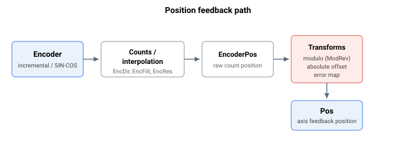

# 编码器

本类别汇总了用于配置和读取轴位置反馈及相关信号接口的关键字。某些产品的每个轴支持一个主编码器和一个辅助编码器；辅助编码器关键字带有额外的 `Aux` 前缀，其行为与对应的主编码器关键字相同。

这些关键字按以下子小节组织：

- **General settings** — 反馈类型与解码、方向、输入滤波、分辨率、用户单位缩放、绝对式编码器配置以及 SIN/COS 设置。参见[general-settings 概述](01-general-settings/00-overview.md)。
- **Index detection** — 捕获编码器索引（参考标志）位置和状态，用于回零。参见[index-detection 概述](02-index-detection/00-overview.md)。
- **Event-based feedback logging** — 在数字事件上锁存反馈位置，并提供历史表。参见[event-based feedback logging 概述](03-event-based-feedback-logging/00-overview.md)。
- **Modulo mode** — 将反馈（及参考）环绕到可配置范围内，用于无限旋转运动。参见[modulo-mode 概述](04-modulo-mode/00-overview.md)。
- **Encoder emulation** — 由轴反馈派生并输出 A/B/Z 正交信号供下游设备使用。参见[encoder-emulation 概述](05-encoder-emulation/00-overview.md)。
- **Virtual encoder** — 一种软件驱动的信号发生器，输出跟踪可选源的正交或脉冲/方向信号。参见[virtual-encoder 概述](06-virtual-encoder/00-overview.md)。
- **Absolute encoder** — 对串行绝对式编码器板载存储器的寄存器读/写事务。参见下方的 absolute-encoder 关键字。

## General settings

| Keyword | Summary |
|---|---|
| [EncType/AuxEncType](01-general-settings/EncType-AuxEncType.md) | 选择编码器反馈类型（增量式、SIN/COS、绝对式或模拟量）。 |
| [EncSubType/AuxEncSubType](01-general-settings/EncSubType-AuxEncSubType.md) | 选择数字增量式编码器子类型（AqB、脉冲方向、C0/C1、up/down）。 |
| [EncDir/AuxEncDir](01-general-settings/EncDir-AuxEncDir.md) | 设置编码器反馈的计数方向。 |
| [EncFilt/AuxEncFilt](01-general-settings/EncFilt-AuxEncFilt.md) | 应用于增量式编码器 A/B/Z 输入通道的数字滤波器。 |
| [EncRes](01-general-settings/EncRes.md) | 编码器分辨率；每磁极间距的计数（直线）或每转的计数（旋转）。 |
| [UsrUnits/AuxUsrUnits](01-general-settings/UsrUnits-AuxUsrUnits.md) | 用户单位与编码器计数之间的比例，用于读取位置及其导数。 |
| [EncAbsBits/AuxEncAbsBits](01-general-settings/EncAbsBits-AuxEncAbsBits.md) | 绝对式编码器读数的位数。 |
| [EncAbsMB/AuxEncAbsMB](01-general-settings/EncAbsMB-AuxEncAbsMB.md) | 从绝对式编码器读数中去除的最低有效位数。 |
| [EncAbsOff/AuxEncAbsOff](01-general-settings/EncAbsOff-AuxEncAbsOff.md) | 上电时加到绝对式编码器读数上的偏置。 |
| [EncAbsVal/AuxEncAbsVal](01-general-settings/EncAbsVal-AuxEncAbsVal.md) | 经位掩码和方向处理后的原始绝对式编码器值。 |
| [EncStatReg](01-general-settings/EncStatReg.md) | 只读状态寄存器，报告绝对式编码器的健康状态位。 |
| [EncAbsFL/EncAbsRL](01-general-settings/EncAbsFL-EncAbsRL.md) | 正向/反向限值，在上电时重新解释超出范围的绝对位置（仅限定制固件）。 |
| [AuxModRev](01-general-settings/AuxModRev.md) | 辅助编码器的取模旋转除数（当前固件未实现）。 |
| [SinCosSetup/AuxSinCosSet](01-general-settings/SinCosSetup-AuxSinCosSet.md) | 配置 SIN/COS 编码器的参数数组。 |
| [SinCosSignals/AuxSinCosSig](01-general-settings/SinCosSignals-AuxSinCosSig.md) | 只读数组，报告 SIN/COS 信号插值的状态。 |

## Index detection

| Keyword | Summary |
|---|---|
| [IndexPos/AuxIndexPos](02-index-detection/IndexPos-AuxIndexPos.md) | 记录最近一次检测到编码器索引的位置。 |
| [IndexStat/AuxIndexStat](02-index-detection/IndexStat-AuxIndexStat.md) | 指示是否已检测到编码器索引脉冲的标志。 |

## Event-based feedback logging

| Keyword | Summary |
|---|---|
| [LockEn/AuxLockEn](03-event-based-feedback-logging/LockEn-AuxLockEn.md) | 启用或禁用基于事件的反馈记录。 |
| [LockSrc/AuxLockSrc](03-event-based-feedback-logging/LockSrc-AuxLockSrc.md) | 选择反馈记录的数字事件源和触发边沿。 |
| [LockCntr/AuxLockCntr](03-event-based-feedback-logging/LockCntr-AuxLockCntr.md) | 对数字事件计数并索引反馈记录历史数组。 |
| [LockVal/AuxLockVal](03-event-based-feedback-logging/LockVal-AuxLockVal.md) | 记录最近一次已记录数字事件的反馈位置。 |
| [LockValTable/LockValTabB](03-event-based-feedback-logging/LockValTable-LockValTabB.md) | 存储每次已记录数字事件反馈位置的历史数组。 |
| [LockTimeTable/LockTimeTabB](03-event-based-feedback-logging/LockTimeTable-LockTimeTabB.md) | 存储每次已记录数字事件控制器周期时间的历史数组。 |

## Modulo mode

| Keyword | Summary |
|---|---|
| [ModRev](04-modulo-mode/ModRev.md) | 取模除数；非零时将反馈（及参考）环绕到范围 [0, ModRev-1]。 |
| [ModShort](04-modulo-mode/ModShort.md) | 在取模模式下为绝对 PTP 选择运动路径（仅限 central-i v5）。 |

## Encoder emulation

| Keyword | Summary |
|---|---|
| [EmulRat](05-encoder-emulation/EmulRat.md) | 反馈编码器计数与仿真输出上发出的正交脉冲之间的比例。 |
| [EmulFilter](05-encoder-emulation/EmulFilter.md) | 应用于编码器仿真输出信号的数字滤波器。 |
| [EmulIndexType](05-encoder-emulation/EmulIndexType.md) | 选择编码器仿真输出上生成的索引脉冲类型。 |

## Virtual encoder

| Keyword | Summary |
|---|---|
| [VEncOn](06-virtual-encoder/VEncOn.md) | 启用或禁用该轴的软件生成虚拟编码器。 |
| [VEncSrc](06-virtual-encoder/VEncSrc.md) | 选择用于生成虚拟编码器位置的源信号。 |
| [VEncType](06-virtual-encoder/VEncType.md) | 设置虚拟编码器的输出格式或信号类型。 |
| [VEncFact](06-virtual-encoder/VEncFact.md) | 应用于虚拟编码器源信号的缩放比例的分子。 |
| [VEncFactDen](06-virtual-encoder/VEncFactDen.md) | 应用于虚拟编码器源信号的缩放比例的分母。 |
| [VEncDelay](06-virtual-encoder/VEncDelay.md) | 脉冲/方向的建立延时，介于方向变化与第一个虚拟编码器脉冲之间。 |
| [VEncValue](06-virtual-encoder/VEncValue.md) | 只读，虚拟编码器输出的累计计数。 |
| [VEncModRev](06-virtual-encoder/VEncModRev.md) | 源取模跨度，使虚拟编码器输出在回绕时保持连续。 |

## Absolute encoder

| Keyword | Summary |
|---|---|
| [EncAbsWRType](07-absolute-encoder/EncAbsWRType.md) | 为下一次绝对式编码器寄存器事务选择读或写访问。 |
| [EncAbsAddr](07-absolute-encoder/EncAbsAddr.md) | 下一次事务要访问的绝对式编码器内寄存器地址。 |
| [EncAbsWData](07-absolute-encoder/EncAbsWData.md) | 写事务时要写入绝对式编码器寄存器的数据值。 |
| [EncAbsRData](07-absolute-encoder/EncAbsRData.md) | 绝对式编码器寄存器读事务返回的数据。 |
| [EncAbsSendCmd](07-absolute-encoder/EncAbsSendCmd.md) | 发起对绝对式编码器寄存器读/写事务的命令。 |
| [EncAbsErrTime](07-absolute-encoder/EncAbsErrTime.md) | 绝对式编码器错误/CRC 状况在轴故障前可持续的周期数；-1 表示禁用。 |
