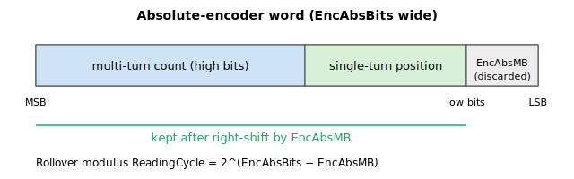

# EncAbsBits/AuxEncAbsBits

Number of bits of the absolute encoder reading.

## Overview

`EncAbsBits` defines the number of bits in the single-turn-plus-multi-turn word read from an absolute encoder. It applies only when the encoder type ([EncType](EncType-AuxEncType.md)) is an absolute encoder — EnDat 2.2 (`EncType=3`), BiSS-C (`EncType=6`) or Tamagawa (`EncType=8`). The bit count tells the controller (and the encoder-interface hardware) how wide the absolute word is, which fixes the unsigned range of the raw reading and the point at which it rolls over. `AuxEncAbsBits` is the auxiliary-encoder counterpart and operates the same way.

Range 12–45 bits, default 22.

## How it works

`EncAbsBits` is consumed in two places.

**1. It configures the encoder-interface hardware.** When `EncAbsBits` (or the encoder type) is written, the firmware programs the interface with `EncAbsBits − 1`:

- On the standalone controller it writes `EncAbsBits − 1` to the encoder-length register.
- On central-i it builds a configuration word whose low 6 bits hold `EncAbsBits − 1` together with the protocol selector (BiSS-C / EnDat) in the next byte, and sends it to the remote encoder interface. Because only 6 bits carry the length, the hardware-programmable width tops out at 64 bits even though the keyword range stops at 45.

**2. It defines the rollover modulus used when the position is accumulated.** Each control cycle the absolute reading is turned into an incremental delta, and the firmware needs to know the value at which the unsigned word wraps. That modulus is precomputed once, when `EncAbsBits` or [EncAbsMB](EncAbsMB-AuxEncAbsMB.md) is written, as

$$\text{ReadingCycle} = 2^{\,\text{EncAbsBits} - \text{EncAbsMB}}$$

`ReadingCycle` is the size of one full turn of the masked absolute word. If `EncAbsBits ≥ 32` the firmware sets `ReadingCycle = 0` (no software wrap handling — the value fills the 32-bit word).

Each control cycle the raw reading is first right-shifted by [EncAbsMB](EncAbsMB-AuxEncAbsMB.md), then direction-handled, then accumulated; the delta between consecutive cycles is corrected by ±`ReadingCycle` when the masked reading wraps past its top or bottom quarter. So `EncAbsBits` indirectly sets both ends of the wrap window.

The bit layout the controller assumes for an absolute word is:



The full word is `EncAbsBits` wide. The lowest `EncAbsMB` bits are discarded; what remains is the meaningful position. The high bits act as the multi-turn count and the low bits as the single-turn (within-one-revolution) position — see [EncAbsMB](EncAbsMB-AuxEncAbsMB.md) for the multi-turn split. The controller treats this as one contiguous unsigned word: it does **not** decode the multi-turn and single-turn halves separately, and `EncAbsMB` is a count of low bits to discard, not a selector for how many multi-turn bits the encoder carries. If the encoder reports more single-turn resolution than you want to accumulate, raise `EncAbsMB`; the high/low naming is only a description of where the turn boundary falls in the masked word.

Changing `EncAbsBits` on a brushless motor invalidates the commutation (the count-to-electrical-angle mapping changes), so the controller flags that commutation must be repeated.

### BiSS-C frame and read cycle

For a BiSS-C encoder (`EncType=6`) the `EncAbsBits` data field is one field inside a larger serial frame that the controller clocks out of the encoder. Each cycle the master sends a clock burst and the encoder returns, in order: an acknowledge bit, a start bit, a single CDS (control-data) bit, the absolute position word, two error/warning status bits, and a CRC. The position word is `EncAbsBits` wide and is transmitted most-significant-bit first. `EncAbsBits` is what tells the controller where the data field ends and the trailing status and CRC bits begin, so an incorrect bit count misframes the whole reading. The two error/warning bits and a failed CRC are surfaced to the host through [EncStatReg](EncStatReg.md).

The full frame is re-clocked and re-read every control cycle — the absolute reading is not latched once at start-up and then counted incrementally in hardware. Each cycle the controller takes the fresh absolute word, masks it (right-shift by `EncAbsMB`), applies direction, and computes the change from the previous cycle to accumulate position. Because the absolute value is re-acquired every cycle, the reported position is self-correcting: a single corrupted or missed frame does not permanently offset the count once clean frames resume (subject to the CRC handling described under [EncStatReg](EncStatReg.md)).

At power-up the accumulated feedback position is seeded directly from the first absolute reading plus [EncAbsOff](EncAbsOff-AuxEncAbsOff.md), so the machine knows its true position immediately without homing — see [Pos](../../10-motion/01-kinematics-status/Pos.md).

### Auxiliary encoder (AuxEncAbsBits)

`AuxEncAbsBits` configures the auxiliary absolute encoder identically. It feeds the same `2^(AuxEncAbsBits − AuxEncAbsMB)` rollover modulus for the auxiliary accumulation path and, on central-i, the auxiliary remote-encoder configuration word.

## Examples

```text
AEncAbsBits=26          ; 26-bit absolute encoder
AEncAbsBits             ; query the configured bit count
AAuxEncAbsBits=22       ; auxiliary absolute encoder is 22-bit
```

## See also

- [EncType](EncType-AuxEncType.md) — encoder type; `EncAbsBits` applies for absolute encoders (3, 6, 8)
- [EncAbsMB](EncAbsMB-AuxEncAbsMB.md) — low bits removed; combines with `EncAbsBits` to set the rollover modulus
- [EncAbsOff](EncAbsOff-AuxEncAbsOff.md) — offset added to the reading at power-up
- [EncAbsVal](EncAbsVal-AuxEncAbsVal.md) — processed absolute reading (after masking and direction)
- [Pos](../../10-motion/01-kinematics-status/Pos.md) — feedback position seeded from the absolute reading at power-up
