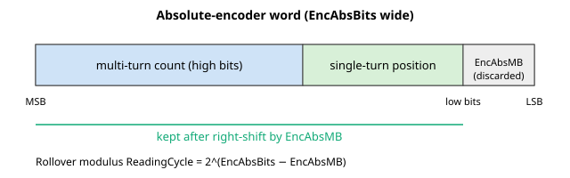

# EncAbsBits/AuxEncAbsBits

绝对式编码器读数的位数。

## 概述

`EncAbsBits` 定义从绝对式编码器读取的单圈加多圈字的位数。它仅在编码器类型（[EncType](EncType-AuxEncType.md)）为绝对式编码器时适用——EnDat 2.2（`EncType=3`）、BiSS-C（`EncType=6`）或 Tamagawa（`EncType=8`）。该位数告知控制器（以及编码器接口硬件）绝对字的宽度，从而确定原始读数的无符号范围及其回绕点。`AuxEncAbsBits` 是辅助编码器对应项，工作方式相同。

范围 12–45 位，默认 22。

## 工作原理

`EncAbsBits` 在两处被使用。

**1. 它配置编码器接口硬件。** 当写入 `EncAbsBits`（或编码器类型）时，固件以 `EncAbsBits − 1` 对接口进行编程：

- 在独立控制器上，它将 `EncAbsBits − 1` 写入编码器长度寄存器。
- 在 central-i 上，它构建一个配置字，其低 6 位保存 `EncAbsBits − 1`，并在下一字节中携带协议选择器（BiSS-C / EnDat），然后将其发送至远程编码器接口。由于只有 6 位承载长度，尽管关键字范围止于 45，硬件可编程宽度上限为 64 位。

**2. 它定义累加位置时所用的回绕模数。** 每个控制周期，绝对读数会被转换为增量差值，固件需要知道无符号字回绕的值。该模数在写入 `EncAbsBits` 或 [EncAbsMB](EncAbsMB-AuxEncAbsMB.md) 时一次性预先计算，公式为

$$\text{ReadingCycle} = 2^{\,\text{EncAbsBits} - \text{EncAbsMB}}$$

`ReadingCycle` 是掩码后绝对字的一整圈大小。如果 `EncAbsBits ≥ 32`，固件将 `ReadingCycle = 0`（无软件回绕处理——该值填满 32 位字）。

每个控制周期，原始读数首先右移 [EncAbsMB](EncAbsMB-AuxEncAbsMB.md) 位，然后进行方向处理，再进行累加；当掩码读数越过其顶部或底部四分之一回绕时，相邻周期之间的差值会以 ±`ReadingCycle` 修正。因此 `EncAbsBits` 间接设定了回绕窗口的两端。

控制器假定的绝对字位布局为：



完整字宽为 `EncAbsBits`。最低的 `EncAbsMB` 位被丢弃；剩余的是有意义的位置。高位作为多圈计数，低位作为单圈（一转之内）位置——有关多圈拆分参见 [EncAbsMB](EncAbsMB-AuxEncAbsMB.md)。控制器将其视为一个连续的无符号字：它**不**单独解码多圈和单圈两部分，并且 `EncAbsMB` 是要丢弃的低位计数，而非选择编码器携带多少多圈位的选择器。如果编码器报告的单圈分辨率超过你想要累加的范围，可增大 `EncAbsMB`；高/低命名只是对掩码字中圈边界落点的描述。

在无刷电机上更改 `EncAbsBits` 会使换相失效（计数到电角度的映射发生变化），因此控制器会标记必须重新进行换相。

### BiSS-C 帧与读取周期

对于 BiSS-C 编码器（`EncType=6`），`EncAbsBits` 数据字段是控制器从编码器时钟读出的较大串行帧内的一个字段。每个周期主机发送一个时钟脉冲串，编码器按顺序返回：一个应答位、一个起始位、一个 CDS（控制数据）位、绝对位置字、两个错误/告警状态位，以及一个 CRC。位置字宽为 `EncAbsBits`，并以最高有效位优先传输。`EncAbsBits` 告知控制器数据字段在何处结束、尾随的状态位和 CRC 位在何处开始，因此错误的位数会使整个读数错帧。两个错误/告警位以及失败的 CRC 通过 [EncStatReg](EncStatReg.md) 呈现给上位机。

完整帧在每个控制周期都会重新时钟读出并重新读取——绝对读数不会在启动时只锁存一次然后在硬件中增量计数。每个周期控制器获取新的绝对字，对其掩码（右移 `EncAbsMB`），应用方向，并计算相对于上一周期的变化以累加位置。由于绝对值每个周期都重新获取，所报告的位置具有自校正性：一旦干净的帧恢复，单个损坏或丢失的帧不会永久偏移计数（受 [EncStatReg](EncStatReg.md) 中所述的 CRC 处理约束）。

上电时，累加反馈位置直接由第一次绝对读数加上 [EncAbsOff](EncAbsOff-AuxEncAbsOff.md) 进行播种，因此机器无需回零即可立即知道其真实位置——参见 [Pos](../../10-motion/01-kinematics-status/Pos.md)。

### 辅助编码器（AuxEncAbsBits）

`AuxEncAbsBits` 以完全相同的方式配置辅助绝对式编码器。它为辅助累加路径提供相同的 `2^(AuxEncAbsBits − AuxEncAbsMB)` 回绕模数，并在 central-i 上提供辅助远程编码器配置字。

## 示例

```text
AEncAbsBits=26          ; 26-bit absolute encoder
AEncAbsBits             ; query the configured bit count
AAuxEncAbsBits=22       ; auxiliary absolute encoder is 22-bit
```

## 另见

- [EncType](EncType-AuxEncType.md) — 编码器类型；`EncAbsBits` 适用于绝对式编码器（3、6、8）
- [EncAbsMB](EncAbsMB-AuxEncAbsMB.md) — 去除的低位；与 `EncAbsBits` 共同确定回绕模数
- [EncAbsOff](EncAbsOff-AuxEncAbsOff.md) — 上电时加到读数上的偏置
- [EncAbsVal](EncAbsVal-AuxEncAbsVal.md) — 处理后的绝对读数（经掩码和方向处理）
- [Pos](../../10-motion/01-kinematics-status/Pos.md) — 上电时由绝对读数播种的反馈位置
