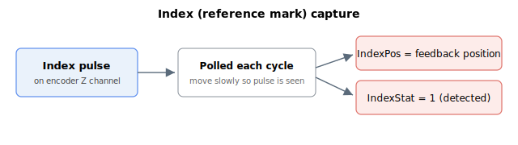

# Index detection

Only incremental encoder (digital incremental AqB, SIN/COS, etc.) has index or reference mark. The index signal is used generally for homing application. Agito controller checks for the index mark at every controller cycle and upon detection, records down the encoder feedback to IndexPos and raise the IndexStat flag.

This index detection method relies on duration of index signal pulse being long enough for the polling to detect the change. Therefore, to avoid missing an index, axis must move at a low speed. Generally,

$$
\text{Speed}\ \left[\frac{\text{count}}{\text{s}}\right] = \text{Count per encoder pitch} \cdot \text{Controller sampling frequency}
$$

with assumption that index pulse is normally 1 encoder pitch wide.

Index detection works similarly for auxiliary encoder (description regarding the main encoder also applies to the auxiliary encoder).

Index detection is a feature subset of [event-based feedback logging](../03-event-based-feedback-logging/00-overview.md) (which offers broader use cases).

> **Note:** Auxiliary-encoder index detection is wired only on the single-axis hardware variants; on multi-axis controllers the auxiliary index is not detected.