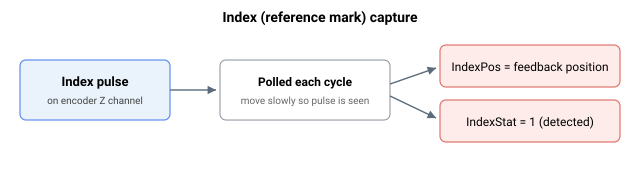

# 索引检测

只有增量式编码器（数字增量式 AqB、SIN/COS 等）才具有索引或参考标志。索引信号通常用于回零应用。Agito 控制器在每个控制器周期检查索引标志，一旦检测到，便将编码器反馈记录到 IndexPos 并置位 IndexStat 标志。

该索引检测方法依赖于索引信号脉冲的持续时间足够长，使轮询能够检测到这一变化。因此，为避免漏检索引，轴必须以低速运动。一般而言，

$$
\text{Speed}\ \left[\frac{\text{count}}{\text{s}}\right] = \text{Count per encoder pitch} \cdot \text{Controller sampling frequency}
$$

此处假设索引脉冲通常为 1 个编码器节距宽。

辅助编码器的索引检测原理类似（关于主编码器的描述同样适用于辅助编码器）。

索引检测是[基于事件的反馈记录](../03-event-based-feedback-logging/00-overview.md)的一个特性子集（后者提供更广泛的用例）。

> **注意：** 辅助编码器索引检测仅在单轴硬件型号上接线；在多轴控制器上不检测辅助索引。
