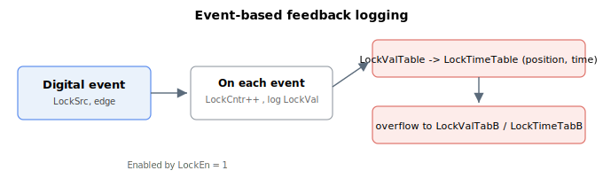

# Event-based feedback logging

Agito allows logging of encoder feedback value based on digital event defined by LockSrc. This feature is enabled by LockEn. After enabling this feature (LockEn = 1), an internal timer (LockTimer) will start from 0.

Each digital event will cause this sequence of actions:

1.  LockCntr to increment
2.  LockVal to log encoder position when the event occurs
3.  LockValTable history array to record the LockVal value
4.  LockTimeTable history array to record the LockTimer value

For digital incremental encoder (AqB, pulse direction, etc.), the feedback logging is done via hardware trigger where digital event will ensure feedback position is instantaneously recorded.

For non-digital incremental encoder (SIN/COS, absolute, etc.), the feedback logging is done via polling at controller cycle rate (about 61µs). Digital event needs to persist long enough until polling is done. The recorded value is exact to actual feedback position at the polling time, but slightly delayed relative to the actual feedback position at the instance of digital event.

For polling method, to avoid missing an index, axis must move at a low speed. Generally,

$$
\text{Speed}\ \left[\frac{\text{count}}{\text{s}}\right] = \text{Count per encoder pitch} \cdot \text{Controller sampling frequency}
$$

with assumption that index pulse is normally 1 encoder pitch wide.

In case LockValTable and LockTimeTable are full, the recording will progress to LockValTabB and LockTimeTabB respectively. If LockValTabB and LockTimeTabB are full, the history logging stops while LockCntr and LockVal continue to update.

**Note:**

1. The logging mechanism works only for main encoder. Please contact Agito if this feature is required for auxiliary encoder.
2. For non-Central-i products, the event-based position logging feature and the event generation feature are mutually exclusive. Enabling one automatically disables the other. For example, enabling event generation ([EventOn](../../18-event-generation/EventOn.md) = 1) will automatically disable event-based feedback logging (`LockEn = 0`).