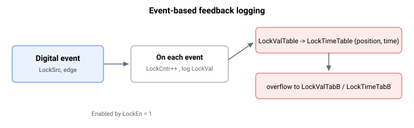

# 基于事件的反馈记录

Agito 允许根据由 LockSrc 定义的数字事件来记录编码器反馈值。该功能通过 LockEn 启用。启用该功能（LockEn = 1）后，内部计时器（LockTimer）将从 0 开始计时。

每个数字事件都将引发以下动作序列：

1.  LockCntr 递增
2.  LockVal 记录事件发生时的编码器位置
3.  LockValTable 历史数组记录 LockVal 值
4.  LockTimeTable 历史数组记录 LockTimer 值

对于数字增量式编码器（AqB、脉冲方向等），反馈记录通过硬件触发完成，其中数字事件可确保反馈位置被即时记录。

对于非数字增量式编码器（SIN/COS、绝对式等），反馈记录通过以控制器周期速率（约 61µs）轮询完成。数字事件需要持续足够长的时间，直到轮询完成。所记录的值与轮询时刻的实际反馈位置完全一致，但相对于数字事件发生瞬间的实际反馈位置略有延迟。

对于轮询方法，为避免漏掉某个索引，轴必须以低速运动。一般而言，

$$
\text{Speed}\ \left[\frac{\text{count}}{\text{s}}\right] = \text{Count per encoder pitch} \cdot \text{Controller sampling frequency}
$$

此处假设索引脉冲通常为 1 个编码器节距宽。

当 LockValTable 和 LockTimeTable 存满时，记录将分别延续至 LockValTabB 和 LockTimeTabB。如果 LockValTabB 和 LockTimeTabB 也已存满，则历史记录停止，而 LockCntr 和 LockVal 继续更新。

**注意：**

1. 该记录机制仅适用于主编码器。如需将此功能用于辅助编码器，请联系 Agito。
2. 对于非 Central-i 产品，基于事件的位置记录功能与事件生成功能是互斥的。启用其中一个会自动禁用另一个。例如，启用事件生成（[EventOn](../../18-event-generation/EventOn.md) = 1）将自动禁用基于事件的反馈记录（`LockEn = 0`）。
