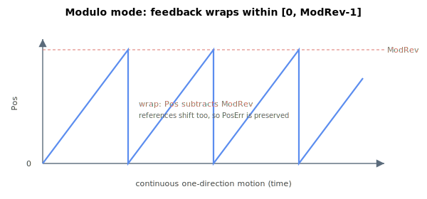

# Modulo mode

Modulo mode allows the encoder feedback to wrap within a range of value (from 0 to ModRev - 1). This mode is generally used for rotary motor to allow axis to move in one direction indefinitely without feedback exceeding the numerical limit.

Modulo mode can be used with moving averaged smoothing ([Jerk](../../../02-keywords/10-motion/03-kinematics-configuration/Jerk.md)) under the condition that the time to move 1 modulo divisor ([ModRev](../../../02-keywords/03-encoder/04-modulo-mode/ModRev.md)) must be longer than the moving time window defined by Jerk. Typically, modulo divisor is defined for 1 revolution. For example,

$$
\text{ModRev}\ [\text{counts}] \geq \frac{\text{Speed}\,\left[\frac{\text{counts}}{\text{s}}\right] \cdot 2^{\,\text{Jerk}}\,[\text{cycles}]}{\text{Controller cycle frequency}\ [\text{Hz}]}
$$

To prevent overflow, modulo divisor must be selected such that the sum of moving window value not exceeding numerical limit. For 64-bit position firmware,

$$
\text{ModRev}\ [\text{counts}] \cdot 2^{\,\text{Jerk}}\,[\text{cycles}] \leq 2^{63} - 1
$$

**Note:**

1. Modulo mode must not be used together with input shaping .
2. Modulo mode is not supported by for auxiliary encoder feedback. Please contact Agito if such application is required.

For more information on the sequence of modulo operation, please refer to [Motion – Kinematics status](../../../02-keywords/10-motion/01-kinematics-status/00-overview.md).
