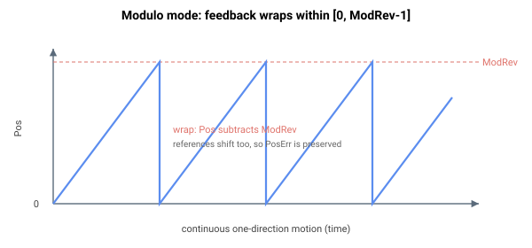

# 取模模式

取模模式允许编码器反馈在某一取值范围内环绕（从 0 到 ModRev - 1）。该模式通常用于旋转电机，使轴能够沿一个方向无限运动，而反馈不会超出数值上限。

取模模式可与移动平均平滑（[Jerk](../../../02-keywords/10-motion/03-kinematics-configuration/Jerk.md)）一起使用，条件是移动 1 个取模除数（[ModRev](../../../02-keywords/03-encoder/04-modulo-mode/ModRev.md)）所需的时间必须长于由 Jerk 定义的移动时间窗口。通常，取模除数按 1 转来定义。例如，

$$
\text{ModRev}\ [\text{counts}] \geq \frac{\text{Speed}\,\left[\frac{\text{counts}}{\text{s}}\right] \cdot 2^{\,\text{Jerk}}\,[\text{cycles}]}{\text{Controller cycle frequency}\ [\text{Hz}]}
$$

为防止溢出，必须选择取模除数，使移动窗口值之和不超过数值上限。对于 64 位位置固件，

$$
\text{ModRev}\ [\text{counts}] \cdot 2^{\,\text{Jerk}}\,[\text{cycles}] \leq 2^{63} - 1
$$

**注意：**

1. 取模模式不得与输入整形一起使用。
2. 取模模式不支持辅助编码器反馈。若需要此类应用，请联系 Agito。

有关取模操作时序的更多信息，请参阅 [Motion – Kinematics status](../../../02-keywords/10-motion/01-kinematics-status/00-overview.md)。
