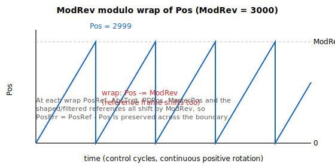

# ModRev

Modulo divisor; wraps the feedback (and references) to the range [0, ModRev-1] when non-zero.

## Overview

`ModRev` defines the divisor used in the modulo operation. When non-zero, modulo mode wraps the feedback position to the range $[0,\ \text{ModRev} - 1]$, which lets a rotary axis move in one direction indefinitely without the feedback exceeding the numerical limit. When `ModRev=0`, modulo operation is disabled. Being axis-scope and flash-saved, it cannot be changed while the motor is on or in motion. The shortest-path behaviour in PTP motion is selected by [ModShort](ModShort.md).

When the feedback ([Pos](../../10-motion/01-kinematics-status/Pos.md)) crosses a modulo boundary, the firmware does not simply wrap `Pos` in isolation: it **shifts the entire position reference frame by `ModRev` in the same direction** so the following error is preserved across the wrap and motion stays continuous. The position reference ([PosRef](../../10-motion/01-kinematics-status/PosRef.md)), the absolute target ([AbsTrgt](../../10-motion/13-motion-mode-ptp/AbsTrgt.md)), the position before mapping ([PosBeforeMap](../../04-error-mapping/PosBeforeMap.md)), the pulse/direction position ([PDPos](../../10-motion/06-motion-mode-pulse-and-direction-pd/PDPos.md)), the gear master position ([MasterPos](../../10-motion/07-motion-mode-gear-motion/MasterPos.md)), and every internal shaped/filtered reference are all moved together. See [Pos](../../10-motion/01-kinematics-status/Pos.md) for how this fits the feedback pipeline.

## How it works

| ModRev value | Description |
|:--:|:--|
| 0 | Modulo operation is disabled. |
| ≠ 0 | Modulo operation is enabled, with feedback wrapped to the range $[0,\ \text{ModRev} - 1]$. |



### Wrap mechanism

Each control cycle, after the feedback has been decoded and error-mapped, the firmware checks the position against the modulo boundaries:

- **High side** — when `Pos ≥ ModRev` (or, for a stepper with [MotorType](../../02-motor-and-amplifier/MotorType.md) = 6, when the final reference reaches `ModRev`), `ModRev` is **subtracted** from the feedback position and from every reference (the position reference, the final reference, [AbsTrgt](../../10-motion/13-motion-mode-ptp/AbsTrgt.md), the shaped/filtered references, [PDPos](../../10-motion/06-motion-mode-pulse-and-direction-pd/PDPos.md), and [MasterPos](../../10-motion/07-motion-mode-gear-motion/MasterPos.md)). Each reference is offset by `ModRev` expressed in its own internal fixed-point scaling.
- **Zero side** — when `Pos < 0`, the same set of values has `ModRev` **added** back.

Because the whole reference frame moves together, `PosErr = PosRef − Pos` is unchanged by the wrap.

### Assumptions and limits

- **Half-revolution per cycle.** The wrap subtracts/adds exactly one `ModRev` per control cycle, assuming the axis travels no more than half of `ModRev` in a single cycle. If exceeded, the position still converges back into range after a few cycles, but behaviour near the boundary is not guaranteed.
- **Jerk buffer.** The wrap is held off until the jerk buffer is clear of pre-wrap values. For truly endless motion the time for one full `ModRev` at max speed must exceed the jerk time ($2^{\text{Jerk}}$ samples) — set `ModRev` large enough.
- **Input shaping must be off.** Modulo is incompatible with input shaping ([ShapingOn](../../11-control-tuning/08-input-shaping/ShapingOn.md)); the controller faults on motor-on if both are enabled.
- **Software limits.** `ModRev` must lie within the software position limits — it is rejected if `ModRev < RevPLim` or `ModRev > FwdPLim`.
- **ECAM coupling.** When an axis is an active ECAM slave whose master is `Pos`/`PosRef`, the slave wraps only together with its master (coupled roll-over), not independently.
- **SetPosition.** Presetting [Pos](../../10-motion/01-kinematics-status/Pos.md) with [SetPosition](../../10-motion/03-kinematics-configuration/SetPosition.md) is allowed but the value should be within `[0, ModRev)`; out-of-range values are pulled back into range over subsequent cycles.

## Examples

The table shows the modulo operation output for a `ModRev` of 3000:

| Modulo operation input (after error mapping) | ModRev value | Modulo operation output |
|:--:|:--:|:--:|
| 3050 | 3000 | 50 |
| 3000 | 3000 | 0 |
| 0 | 3000 | 0 |
| -40 | 3000 | 2960 |

```text
AModRev=3000         ; wrap feedback to [0, 2999]
AModRev=0            ; disable modulo mode
```

## Changes between versions

`ModRev` itself is a 32-bit value on all versions. What differs is the position it wraps:

| | v4 (standalone & central-i) | v5 (central-i) |
|---|---|---|
| Wrapped position pipeline | 32-bit ([Pos](../../10-motion/01-kinematics-status/Pos.md) is 32-bit) | **64-bit** ([Pos](../../10-motion/01-kinematics-status/Pos.md) is 64-bit) |

In **v5** the feedback pipeline moved to 64-bit, so the wrap arithmetic operates on a 64-bit `Pos` and the references. The divisor range is unchanged. **v5 is central-i only.**

## See also

- [ModShort](ModShort.md) — shortest-path selection for PTP motion under modulo mode
- [Pos](../../10-motion/01-kinematics-status/Pos.md) — feedback position that is wrapped (see its feedback-pipeline and ModRev sections)
- [PosRef](../../10-motion/01-kinematics-status/PosRef.md) / [AbsTrgt](../../10-motion/13-motion-mode-ptp/AbsTrgt.md) — references that also wrap for continuity
- [ShapingOn](../../11-control-tuning/08-input-shaping/ShapingOn.md) — input shaping, which must be off when modulo is enabled
