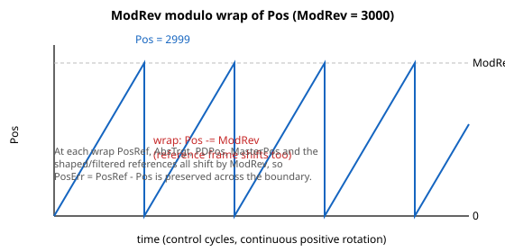

# ModRev

取模除数；当非零时，将反馈（及参考）环绕到范围 [0, ModRev-1]。

## 概述

`ModRev` 定义取模操作中所用的除数。当非零时，取模模式将反馈位置环绕到范围 $[0,\ \text{ModRev} - 1]$，从而使旋转轴能够沿一个方向无限运动，而反馈不会超出数值上限。当 `ModRev=0` 时，取模操作被禁用。由于其为轴相关参数且保存至闪存，因此在电机使能或运动中时无法更改。PTP 运动中的最短路径行为由 [ModShort](ModShort.md) 选择。

当反馈（[Pos](../../10-motion/01-kinematics-status/Pos.md)）越过取模边界时，固件并不会孤立地仅环绕 `Pos`：它**将整个位置参考坐标系沿同一方向移动 `ModRev`**，从而在环绕过程中保持跟随误差，并使运动保持连续。位置参考（[PosRef](../../10-motion/01-kinematics-status/PosRef.md)）、绝对目标（[AbsTrgt](../../10-motion/13-motion-mode-ptp/AbsTrgt.md)）、脉冲/方向位置（[PDPos](../../10-motion/06-motion-mode-pulse-and-direction-pd/PDPos.md)）、齿轮主轴位置（[MasterPos](../../10-motion/07-motion-mode-gear-motion/MasterPos.md)），以及每一个内部整形/滤波后的参考，都会一起移动。关于这如何契合反馈流水线，参见 [Pos](../../10-motion/01-kinematics-status/Pos.md)。

## 工作原理

| ModRev 值 | 描述 |
|:--:|:--|
| 0 | 取模操作被禁用。 |
| ≠ 0 | 取模操作被启用，反馈被环绕到范围 $[0,\ \text{ModRev} - 1]$。 |



### 环绕机制

每个控制周期，在反馈被解码并经误差映射之后，固件根据取模边界检查位置：

- **高侧** —— 当 `Pos ≥ ModRev` 时（或者，对于 [MotorType](../../02-motor-and-amplifier/MotorType.md) = 6 的步进电机，当最终参考达到 `ModRev` 时），`ModRev` 会从反馈位置以及每个参考中被**减去**（位置参考、最终参考、[AbsTrgt](../../10-motion/13-motion-mode-ptp/AbsTrgt.md)、整形/滤波后的参考、[PDPos](../../10-motion/06-motion-mode-pulse-and-direction-pd/PDPos.md) 和 [MasterPos](../../10-motion/07-motion-mode-gear-motion/MasterPos.md)）。每个参考都按其自身内部定点缩放表示的 `ModRev` 进行偏移。
- **零侧** —— 当 `Pos < 0` 时，同一组值会被加回 `ModRev`。

由于整个参考坐标系一起移动，因此 `PosErr = PosRef − Pos` 不会因环绕而改变。

**开环步进电机（[MotorType](../../02-motor-and-amplifier/MotorType.md) = 6）。** 此处的环绕由位置*参考*越过边界触发（高侧时参考 `≥ ModRev`，零侧时参考 `< 0`），而非由反馈触发。环绕时，步进电机仅更新其电气周期偏移——掩码到一个电气周期——并跳过从反馈位置减去/加上 `ModRev`（没有编码器反馈可供环绕）。共享参考（[PosRef](../../10-motion/01-kinematics-status/PosRef.md)、[AbsTrgt](../../10-motion/13-motion-mode-ptp/AbsTrgt.md)、[PDPos](../../10-motion/06-motion-mode-pulse-and-direction-pd/PDPos.md)、[MasterPos](../../10-motion/07-motion-mode-gear-motion/MasterPos.md) 以及整形/滤波后的参考）仍会精确地移动 `ModRev`，与闭环情形完全相同，因此指令运动在边界处保持连续。

### 假设与限制

- **每周期半转。** 环绕在每个控制周期精确地减去/加上一个 `ModRev`，前提是轴在单个周期内行进不超过 `ModRev` 的一半。若超出，位置仍会在几个周期后收敛回范围内，但边界附近的行为不予保证。
- **Jerk 缓冲区。** 环绕会被推迟，直到移动平均（[Jerk](../../10-motion/03-kinematics-configuration/Jerk.md)）缓冲区已清除环绕前的值。每次环绕都会将内部的"错误值"计数改变 $2^{\text{Jerk}}$（高侧环绕时递减，零侧环绕时递增），并且当该计数非零时进一步的环绕会被抑制——因此两次环绕不会落在同一个 jerk 窗口内。当该计数非零时，馈入平滑参考的运行总和会被 `count × ModRev` 修正（缩放到该总和的定点），并且随着环绕前的采样老化移出窗口，该计数每周期衰减 1，一旦缓冲区只保存环绕后的值即达到零。对于真正无限的运动，以最大速度覆盖一个完整 `ModRev` 所需的时间必须超过 jerk 时间（$2^{\text{Jerk}}$ 个采样）——应使 `ModRev` 足够大。
- **输入整形必须关闭。** 取模与输入整形（[ShapingOn](../../11-control-tuning/08-input-shaping/ShapingOn.md)）不兼容。该组合在电机使能时被阻止（MotorOn 请求被拒绝），并且如果在运行期间出现该组合，轴会以 [ConFlt](../../07-status-and-faults/ConFlt.md) = 1032（不当的取模用法）发生故障。
- **软件限位。** `ModRev` 的写入本身只针对 `[0, 2000000000]` 进行范围检查，因此即使非零值超出软件位置限位仍会被存储。限位检查在运动开始时强制执行：如果 `ModRev` 非零且 `ModRev < RevPLim` 或 `ModRev > FwdPLim`，则该运动会以指令错误 267（ModRev 值超出 SW 位置范围）被拒绝，轴不会开始运动。
- **ECAM 耦合。** 当某轴为活动的 ECAM 从轴，且其主轴为 `Pos`/`PosRef` 时，从轴仅与其主轴一起环绕（耦合回绕），而非独立环绕。
- **SetPosition。** 允许使用 [SetPosition](../../10-motion/03-kinematics-configuration/SetPosition.md) 预设 [Pos](../../10-motion/01-kinematics-status/Pos.md)，但该值应在 `[0, ModRev)` 范围内；超出范围的值会在随后的几个周期内被拉回范围内。

## 示例

下表显示 `ModRev` 为 3000 时的取模操作输出：

| 取模操作输入（误差映射后） | ModRev 值 | 取模操作输出 |
|:--:|:--:|:--:|
| 3050 | 3000 | 50 |
| 3000 | 3000 | 0 |
| 0 | 3000 | 0 |
| -40 | 3000 | 2960 |

```text
AModRev=3000         ; wrap feedback to [0, 2999]
AModRev=0            ; disable modulo mode
```

## 边界情况

- **电机使能 / 运动中。** 写入被拒绝。更改除数之前应停止该轴并禁用电机；一旦更改，环绕立即生效，随着整个参考坐标系移动，`PosErr` 得以保持。
- **每周期半转。** 环绕在每个控制周期精确地减去/加上一个 `ModRev`；如果轴在一个采样内行进超过 `ModRev/2`，位置仍会在几个周期后收敛回范围内，但边界行为未定义。
- **输入整形。** 取模与 [ShapingOn](../../11-control-tuning/08-input-shaping/ShapingOn.md) 不兼容。当两者同时启用时 MotorOn 请求被拒绝，并且如果在运行期间出现该组合，轴会以 [ConFlt](../../07-status-and-faults/ConFlt.md) = 1032（不当的取模用法）发生故障。
- **软件限位。** 写入 `ModRev` 不会针对软件位置限位被拒绝（只针对 `[0, 2000000000]`）；该检查被推迟到运动开始时。超出 `[RevPLim, FwdPLim]` 的非零 `ModRev` 会使运动以指令错误 267（ModRev 值超出 SW 位置范围）被拒绝，而不是使写入失败。
- **SetPosition。** 允许，但值应在 `[0, ModRev)` 范围内；超出范围的预设会在随后的几个周期内被拉回范围内。
- **辅助编码器。** 取模仅针对主编码器实现；[AuxModRev](../01-general-settings/AuxModRev.md) 虽已定义但在当前固件中未被使用，因此辅助反馈不会环绕。
- **ECAM 从轴。** 当某轴为活动的 ECAM 从轴，且其主轴为 `Pos`/`PosRef` 时，从轴与其主轴耦合环绕，而非独立环绕。
- **Central-i 断开。** `ModRev` 是主轴侧的设置；当端口断开时，主轴的环绕运算会继续对其最后接收到的 `Pos` 进行操作。

## 版本间变化

`ModRev` 本身在所有版本上均为 32 位值。不同之处在于它所环绕的位置：

| | v4（独立产品与 central-i） | v5（central-i） |
|---|---|---|
| 被环绕的位置流水线 | 32 位（[Pos](../../10-motion/01-kinematics-status/Pos.md) 为 32 位） | **64 位**（[Pos](../../10-motion/01-kinematics-status/Pos.md) 为 64 位） |

在 **v5** 中，反馈流水线迁移到 64 位，因此环绕运算作用于 64 位的 `Pos` 及参考。除数范围保持不变。**v5 仅限 central-i。**

## 另见

- [ModShort](ModShort.md) —— 取模模式下 PTP 运动的最短路径选择
- [Pos](../../10-motion/01-kinematics-status/Pos.md) —— 被环绕的反馈位置（参见其反馈流水线及 ModRev 章节）
- [PosRef](../../10-motion/01-kinematics-status/PosRef.md) / [AbsTrgt](../../10-motion/13-motion-mode-ptp/AbsTrgt.md) —— 同样会为保持连续性而环绕的参考
- [ShapingOn](../../11-control-tuning/08-input-shaping/ShapingOn.md) —— 输入整形，启用取模时必须关闭
