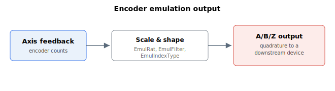

# Encoder emulation

Encoder emulation lets the controller output an A/B/Z quadrature signal derived from the axis feedback, so the position can be passed to a downstream device that expects an incremental encoder input.

The keywords in this section configure the emulated output:

- [EmulRat](EmulRat.md) — ratio between feedback counts and emitted quadrature pulses
- [EmulFilter](EmulFilter.md) — digital filter applied to the emulated output
- [EmulIndexType](EmulIndexType.md) — type of index (Z) pulse on the emulated output
