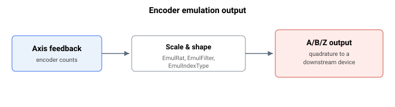

# 编码器仿真

编码器仿真使控制器能够输出由轴反馈导出的 A/B/Z 正交信号，从而将位置传递给期望增量式编码器输入的下游设备。

本节中的关键字用于配置仿真输出：

- [EmulRat](EmulRat.md) —— 反馈计数与输出正交脉冲之间的比率
- [EmulFilter](EmulFilter.md) —— 应用于仿真输出的数字滤波器
- [EmulIndexType](EmulIndexType.md) —— 仿真输出上索引（Z）脉冲的类型
