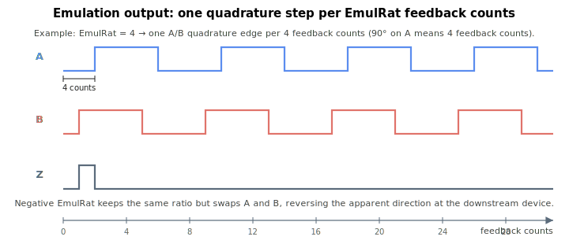

# EmulRat

Ratio between feedback encoder counts and the quadrature pulses emitted on the emulation output.

## Overview

`EmulRat` sets the divide ratio between the feedback encoder counts and the A/B quadrature pulses emitted on the encoder emulation interface. It lets the emulated output match the resolution a downstream device expects, and its sign selects the count direction of the emulated signal. It works together with [EmulFilter](EmulFilter.md) (output filtering) and [EmulIndexType](EmulIndexType.md) (index pulse type), and relates to the feedback resolution set by [EncRes](../01-general-settings/EncRes.md). It is an axis-scope parameter saved to flash and can be changed while the motor is on or in motion. The range is -65536 to 65536.

## How it works

`EmulRat` is applied by the emulation hardware. Writing the keyword programs the per-axis emulation factor and the A/B phase order:

| `EmulRat` | Emulation factor | A/B phase (direction) |
|---|---|---|
| > 0 | `EmulRat − 1` | normal |
| 0 | `0` (behaves like a factor of 1) | normal |
| < 0 | `−EmulRat − 1` | inverted (A and B swapped) |

The hardware emits one quadrature edge per (factor + 1) internal counts, so a positive `EmulRat = N` divides the feedback by `N`. A value of 0 collapses to the same behaviour as `EmulRat = 1` (factor 0 — pass-through). A negative value uses the magnitude as the divide ratio while inverting the A/B phase, which reverses the apparent count direction at the downstream device.

On older hardware revisions the emulation output also has to be muxed onto the differential output pins (selecting emulation vs. plain differential outputs); on current revisions the output mux is configured per axis as part of the same write.



**Worked example.** With a rotary motor at [EncRes](../01-general-settings/EncRes.md) = 10000 counts/revolution and `EmulRat = 4`, the emulated output emits one A/B quadrature edge for every 4 feedback counts. Per revolution that is `10000 / 4 = 2500` A/B edges (≈ 625 full A/B cycles). Setting `EmulRat = -4` keeps the same 1:4 ratio but swaps A/B, so the downstream device counts in the opposite direction.

## Examples

```text
AEmulRat=4           ; one quadrature step per 4 feedback counts, normal direction
AEmulRat=-4          ; same 1:4 ratio, reversed emulated direction
AEmulRat=1           ; pass-through (one emulated step per feedback count)
AEmulRat             ; query the configured ratio
```

## See also

- [EmulFilter](EmulFilter.md) — filter applied to the emulated output
- [EmulIndexType](EmulIndexType.md) — index pulse type on the emulated output
- [EncRes](../01-general-settings/EncRes.md) — feedback encoder resolution
