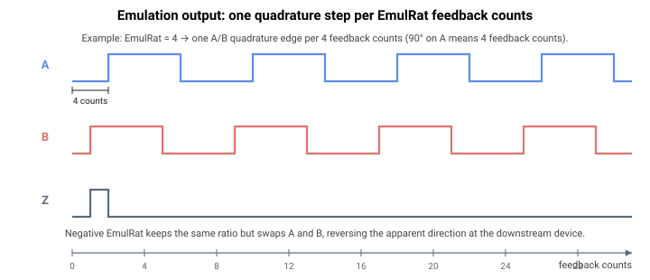

# EmulRat

反馈编码器计数与仿真输出上发出的正交脉冲之间的比值。

## 概述

`EmulRat` 设置反馈编码器计数与编码器仿真接口上发出的 A/B 正交脉冲之间的分频比。它使仿真输出能够匹配下游设备所期望的分辨率，其符号则选择仿真信号的计数方向。它与 [EmulFilter](EmulFilter.md)（输出滤波）和 [EmulIndexType](EmulIndexType.md)（索引脉冲类型）协同工作，并与由 [EncRes](../01-general-settings/EncRes.md) 设置的反馈分辨率相关。它是轴相关参数，保存至闪存，并可在电机使能或运动中更改。范围为 -65536 至 65536。

## 工作原理

`EmulRat` 由仿真硬件应用。写入该关键字会对每个轴的仿真因子和 A/B 相序进行编程：

| `EmulRat` | 仿真因子 | A/B 相位（方向） |
|---|---|---|
| > 0 | `EmulRat − 1` | 正常 |
| 0 | `0`（行为与因子 1 相同） | 正常 |
| < 0 | `−EmulRat − 1` | 反向（A 与 B 互换） |

硬件每经过 (factor + 1) 个内部计数发出一个正交边沿，因此正的 `EmulRat = N` 将反馈分频 N。值为 0 时退化为与 `EmulRat = 1` 相同的行为（因子 0 —— 直通）。负值使用其幅值作为分频比，同时反转 A/B 相位，从而使下游设备处的表观计数方向反向。

在较旧的硬件版本上，仿真输出还必须多路复用到差分输出引脚上（选择仿真输出还是普通差分输出）；在当前版本上，输出多路复用作为同一次写入的一部分按轴进行配置。在这些较旧版本上，`EmulRat = 0` 是一种特殊情况：它不发出直通仿真信号，而是将引脚切换回普通差分输出（关闭仿真）。在当前版本上，`EmulRat = 0` 保持仿真启用，并采用如上所示的因子 1（直通）行为。



**示例计算。** 对于一台旋转电机，[EncRes](../01-general-settings/EncRes.md) = 10000 counts/revolution 且 `EmulRat = 4`，仿真输出每 4 个反馈计数发出一个 A/B 正交边沿。每转即为 `10000 / 4 = 2500` 个 A/B 边沿（≈ 625 个完整 A/B 周期）。设置 `EmulRat = -4` 保持相同的 1:4 比值，但互换 A/B，因此下游设备以相反方向计数。

## 示例

```text
AEmulRat=4           ; one quadrature step per 4 feedback counts, normal direction
AEmulRat=-4          ; same 1:4 ratio, reversed emulated direction
AEmulRat=1           ; pass-through (one emulated step per feedback count)
AEmulRat             ; query the configured ratio
```

## 另请参阅

- [EmulFilter](EmulFilter.md) —— 应用于仿真输出的滤波器
- [EmulIndexType](EmulIndexType.md) —— 仿真输出上的索引脉冲类型
- [EncRes](../01-general-settings/EncRes.md) —— 反馈编码器分辨率
