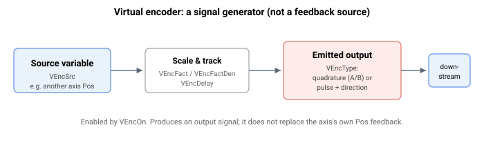

# 虚拟编码器

虚拟编码器是一种软件驱动的编码器信号发生器：启用后，控制器在轴的编码器仿真输出上发出一个真实的正交或脉冲/方向信号，该信号按所配置的缩放和延迟跟踪一个可选择的内部源变量。它不会替代轴自身的位置反馈；它产生一个下游设备可以读取的输出信号。这在向另一台设备传递软件定义的源、进行仿真，或与外部过程同步时很有用。

本节中的关键字用于配置虚拟编码器：

- [VEncOn](VEncOn.md) —— 启用或禁用虚拟编码器
- [VEncSrc](VEncSrc.md) —— 选择源信号
- [VEncType](VEncType.md) —— 设置输出格式
- [VEncFact](VEncFact.md) / [VEncFactDen](VEncFactDen.md) —— 缩放比值的分子 / 分母
- [VEncDelay](VEncDelay.md) —— 应用于输出的固定延迟
- [VEncModRev](VEncModRev.md) —— 源取模跨度，使输出在回绕时保持连续
- [VEncValue](VEncValue.md) —— 虚拟编码器发出的只读累计计数
