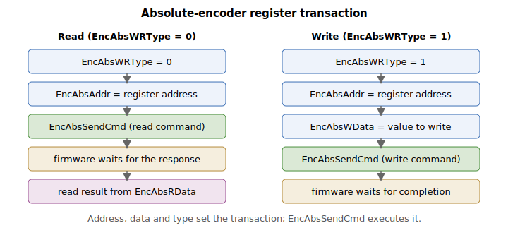

# EncAbsSendCmd

Command that initiates a register read/write transaction to the absolute encoder.

## Overview

`EncAbsSendCmd` is a command function that initiates a register read or write transaction to the absolute encoder using the address, data, and type previously loaded into [EncAbsAddr](EncAbsAddr.md), [EncAbsWData](EncAbsWData.md), and [EncAbsWRType](EncAbsWRType.md). After a read transaction completes, [EncAbsRData](EncAbsRData.md) holds the value read back. It is an axis-scope command function. The whole interface targets the on-encoder memory of a serial absolute encoder (the Tamagawa family, [EncType](../01-general-settings/EncType-AuxEncType.md) = 8) and is available on v4 firmware only.

## How it works

The transaction is carried out synchronously while the command runs. The command branches on [EncAbsWRType](EncAbsWRType.md):

**Read ([EncAbsWRType](EncAbsWRType.md) = 0)**
1. Write [EncAbsAddr](EncAbsAddr.md) to the encoder-interface memory-address register.
2. Issue the encoder "read from memory" data command.
3. Wait a fixed number of control cycles for the encoder to respond.
4. Read the returned byte, bit-reverse it (the encoder transmits LSB-first), and store it in [EncAbsRData](EncAbsRData.md).

**Write ([EncAbsWRType](EncAbsWRType.md) = 1)**
1. Write [EncAbsAddr](EncAbsAddr.md) to the memory-address register.
2. Write [EncAbsWData](EncAbsWData.md) to the write-data register.
3. Issue the encoder "write to memory" data command.
4. Wait a fixed number of control cycles for the write to complete.

After either branch the firmware returns the encoder-interface command to its idle (normal position-readout) state, then replies OK to the host. On a central-i master the same sequence is sent to the remote unit over the central-i link; if the addressed port is not active the command returns a "port not active" error. Registers and data are 8-bit (0–255).



Because the transaction blocks while it waits for the encoder, and the parameters cannot be changed with the motor on or in motion, this interface is intended for offline configuration/diagnostics rather than runtime use.

## Examples

```text
AEncAbsWRType=0      ; configure for a read
AEncAbsAddr=16       ; target register 16
AEncAbsSendCmd       ; execute the transaction; result in EncAbsRData
AEncAbsRData         ; read back the returned byte
```

## See also

- [EncAbsAddr](EncAbsAddr.md) — register address for the transaction
- [EncAbsWRType](EncAbsWRType.md) — selects read or write access
- [EncAbsWData](EncAbsWData.md) — data to write on a write transaction
- [EncAbsRData](EncAbsRData.md) — data read back on a read transaction
- [EncType](../01-general-settings/EncType-AuxEncType.md) — encoder type; this interface applies to the serial absolute (Tamagawa) encoder
