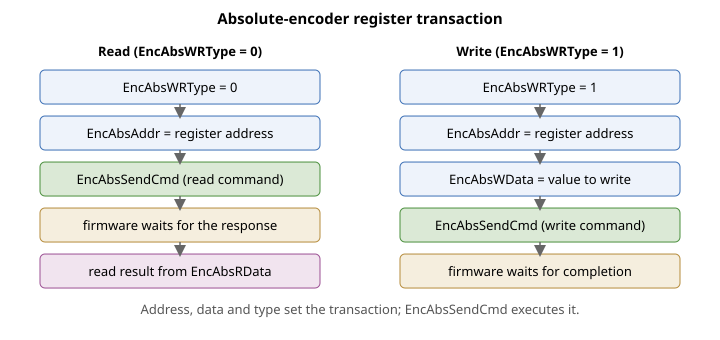

# EncAbsSendCmd

发起对绝对式编码器的寄存器读/写事务的命令。

## 概述

`EncAbsSendCmd` 是一个命令函数，它使用先前载入 [EncAbsAddr](EncAbsAddr.md)、[EncAbsWData](EncAbsWData.md) 和 [EncAbsWRType](EncAbsWRType.md) 的地址、数据和类型，发起对绝对式编码器的寄存器读取或写入事务。读取事务完成后，[EncAbsRData](EncAbsRData.md) 保存读回的值。它是轴相关命令函数。整个接口针对串行绝对式编码器（Tamagawa 系列，[EncType](../01-general-settings/EncType-AuxEncType.md) = 8）的板载存储器，仅适用于 v4 固件。

## 工作原理

该事务在命令运行期间同步执行。命令根据 [EncAbsWRType](EncAbsWRType.md) 进行分支：

**读取（[EncAbsWRType](EncAbsWRType.md) = 0）**
1. 将 [EncAbsAddr](EncAbsAddr.md) 写入编码器接口的存储器地址寄存器。
2. 发出编码器“从存储器读取”数据命令。
3. 等待固定数量的控制周期，让编码器响应。
4. 读取返回的字节，对其进行位反转（编码器以 LSB 优先方式传输），并将其存入 [EncAbsRData](EncAbsRData.md)。

**写入（[EncAbsWRType](EncAbsWRType.md) = 1）**
1. 将 [EncAbsAddr](EncAbsAddr.md) 写入存储器地址寄存器。
2. 将 [EncAbsWData](EncAbsWData.md) 写入写数据寄存器。
3. 发出编码器“写入存储器”数据命令。
4. 等待固定数量的控制周期，让写入完成。

任一分支完成后，固件将编码器接口命令返回其空闲（正常位置读出）状态，然后向上位机回复 OK。在 central-i 主控上，相同的序列通过 central-i 链路发送至远程单元；如果被寻址的端口未激活，命令将返回“port not active”错误。寄存器和数据均为 8 位（0–255）。



由于事务在等待编码器期间会阻塞，且参数在电机使能或运动中无法更改，此接口旨在用于离线配置/诊断，而非运行时使用。

## 示例

```text
AEncAbsWRType=0      ; configure for a read
AEncAbsAddr=16       ; target register 16
AEncAbsSendCmd       ; execute the transaction; result in EncAbsRData
AEncAbsRData         ; read back the returned byte
```

## 参见

- [EncAbsAddr](EncAbsAddr.md) — 事务的寄存器地址
- [EncAbsWRType](EncAbsWRType.md) — 选择读或写访问
- [EncAbsWData](EncAbsWData.md) — 写入事务中要写入的数据
- [EncAbsRData](EncAbsRData.md) — 读取事务中读回的数据
- [EncType](../01-general-settings/EncType-AuxEncType.md) — 编码器类型；此接口适用于串行绝对式（Tamagawa）编码器
