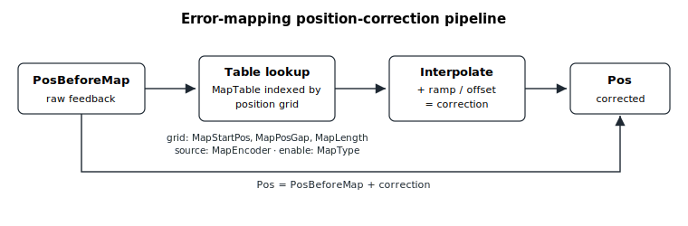

# Error mapping

Error mapping corrects systematic position errors by adding a stored correction to the feedback. Agito supports 1D, 2D and 3D error mapping.

## Overview

Error mapping works by correcting the feedback ([Pos](../10-motion/01-kinematics-status/Pos.md)), not the command ([PosRef](../10-motion/01-kinematics-status/PosRef.md)). [PosBeforeMap](PosBeforeMap.md) is the position value from the encoder **before** error-mapping correction, while [Pos](../10-motion/01-kinematics-status/Pos.md) is the position value **after** correction. The difference between them is the correction contributed by the map.



The category keywords fit together as follows:

- [MapType](MapType.md) selects the error-mapping dimension: 1D, 2D, or 3D.
- [MapEncoder](MapEncoder.md)`[]` selects which axis's encoder is used for the mapping.
- [MapStartPos](MapStartPos.md)`[]`, [MapPosGap](MapPosGap.md)`[]`, and [MapLength](MapLength.md)`[]` define the coordinates of the error-mapping points.
- [MapTable](MapTable-MapTableB-MapTableC-MapTableD-MapTableE.md)`[]` stores the error values. `MapTableB[]`, `MapTableC[]`, `MapTableD[]`, and `MapTableE[]` extend the array size — i.e. `MapTableB[1]` comes after `MapTable[65536]`.
- [MapStartIndex](MapStartIndex.md) selects the `MapTable` index where the active map begins.
- [MapErrOffset](MapErrOffset.md), [MapErrOffRamp](MapErrOffRamp.md), and [MapErrOnStep](MapErrOnStep.md) govern how the correction is ramped in when mapping engages, avoiding an abrupt position jump.

The correction values are stored as one flat, 1-based list starting at [MapStartIndex](MapStartIndex.md). For multi-dimensional maps the **first** dimension varies fastest. For example, a 2D map of 3 first-dimension points by 2 second-dimension points occupies six consecutive table entries laid out like this:

| Second dimension | First-dim point 1 | First-dim point 2 | First-dim point 3 |
|------------------|:--:|:--:|:--:|
| Point 1 | `MapTable[1]` | `MapTable[2]` | `MapTable[3]` |
| Point 2 | `MapTable[4]` | `MapTable[5]` | `MapTable[6]` |

## Walk-through: apply a 1D map at runtime

Suppose the encoder under axis A is known to have a small repeatable position error from `0` to `100000` counts, sampled at `1000`-count intervals. A 1D map can correct it on the fly. Mapping touches the **feedback** (it adjusts [Pos](../10-motion/01-kinematics-status/Pos.md)), not the command, and is configured with the motor off because the geometry is precomputed when [MapType](MapType.md) is written.

1. **Define the lookup geometry.** For a 1D map only the `[1]` slot of each per-dimension array is used. Choose this axis's own main encoder as the source (it must be — `MapEncoder[1]` is checked when the map is built):

   ```text
   AMotorOn=0                  ; mapping cannot be enabled while in motion
   AMapEncoder[1]=1            ; first dimension: axis A's main encoder
   AMapStartPos[1]=0           ; first correction point at encoder count 0
   AMapPosGap[1]=1000          ; correction points spaced 1000 counts apart
   AMapLength[1]=101           ; 101 points: covers 0 .. 100000 counts inclusive
   AMapStartIndex=1            ; active table starts at MapTable[1]
   ```

2. **Load the correction values** into [MapTable](MapTable-MapTableB-MapTableC-MapTableD-MapTableE.md). Each value is the correction added to the raw encoder reading at that grid point, in user units; values between grid points are linearly interpolated. (Outside the configured range the correction is held flat — no extrapolation — so set `MapStartPos` and `MapLength` to bracket the full travel you want corrected.)

   ```text
   AMapTable[1]=0              ; correction at encoder count 0
   AMapTable[2]=2              ; correction at encoder count 1000
   AMapTable[3]=3              ; correction at encoder count 2000
   ; ... fill through MapTable[101] for count 100000
   ```

3. **Engage the map** by writing [MapType](MapType.md) = `1`. The correction does not switch on abruptly: the controller ramps it from zero up to full scale at the rate set by [MapErrOnStep](MapErrOnStep.md), so the corrected position [Pos](../10-motion/01-kinematics-status/Pos.md) does not step. Then re-enable the motor and move:

   ```text
   AMapErrOnStep=100           ; ramp-in step per cycle (smooth engagement)
   AMapType=1                  ; enable 1D mapping (ramped in)
   AMotorOn=1                  ; re-enable
   ; ... command a normal motion ...
   ```

4. **Verify the correction.** [PosBeforeMap](PosBeforeMap.md) reports the raw main-encoder reading *before* the correction; [Pos](../10-motion/01-kinematics-status/Pos.md) reports the corrected value. Their difference is the correction the map is currently contributing (after the engage ramp):

   ```text
   APosBeforeMap               ; raw main encoder, no correction applied
   APos                        ; corrected feedback (Pos = PosBeforeMap + correction)
   ```

   In **simulation** mode the correction is deliberately skipped (`Pos = PosBeforeMap`); otherwise the two readings differ by the active correction.

5. **Disengage** by writing `AMapType=0`. The user value is set to `0` immediately, but the internal correction is **ramped down** by `MapErrOnStep` before the map fully releases, so the corrected position decays gracefully back to the raw value. With `MapErrOnStep=0` the change is immediate (one cycle).

For 2D and 3D maps the same flow applies, with [MapType](MapType.md) = `2` or `3` and the `[2]` / `[3]` slots of each per-dimension array filled. The total table size — `MapLength[1] x MapLength[2] x MapLength[3]` for 3D — must fit within the combined `MapTable`/`MapTableB`/`MapTableC`/`MapTableD`/`MapTableE` banks, and the additional source axes named by `MapEncoder` must be motor-on and stationary while the table is built.
