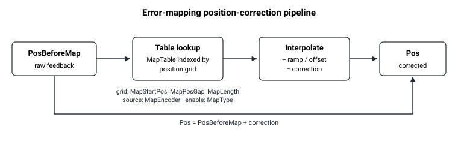

# 误差映射

误差映射通过向反馈值添加存储的修正值来修正系统性位置误差。Agito 支持 1D、2D 和 3D 误差映射。

## 概述

误差映射的工作方式是修正反馈值（[Pos](../10-motion/01-kinematics-status/Pos.md)），而不是修正指令（[PosRef](../10-motion/01-kinematics-status/PosRef.md)）。[PosBeforeMap](PosBeforeMap.md) 是编码器在误差映射修正**之前**的位置值，而 [Pos](../10-motion/01-kinematics-status/Pos.md) 是修正**之后**的位置值。两者之差即为映射所贡献的修正值。



该类别的各关键字配合方式如下：

- [MapType](MapType.md) 选择误差映射的维度：1D、2D 或 3D。
- [MapEncoder](MapEncoder.md)`[]` 选择用于映射的轴编码器。
- [MapStartPos](MapStartPos.md)`[]`、[MapPosGap](MapPosGap.md)`[]` 和 [MapLength](MapLength.md)`[]` 定义误差映射点的坐标。
- [MapTable](MapTable-MapTableB-MapTableC-MapTableD-MapTableE.md)`[]` 存储误差值。`MapTableB[]`、`MapTableC[]`、`MapTableD[]` 和 `MapTableE[]` 扩展数组大小，这五个存储区首尾相接，串联成一个连续的、从 1 开始索引的空间。每个存储区的确切大小**取决于产品型号**——请参阅关键字页面了解各产品的具体大小。
- [MapStartIndex](MapStartIndex.md) 选择活动映射在 `MapTable` 中起始的索引。
- [MapErrOffset](MapErrOffset.md)、[MapErrOffRamp](MapErrOffRamp.md) 和 [MapErrOnStep](MapErrOnStep.md) 控制映射接入时修正值如何按斜坡接入，从而避免位置突跳。

修正值以一个扁平的、从 1 开始的列表形式存储，起始于 [MapStartIndex](MapStartIndex.md)。对于多维映射，**第一**维变化最快。例如，一个由 3 个第一维点 × 2 个第二维点组成的 2D 映射占用六个连续的表项，其排列方式如下：

| 第二维 | 第一维点 1 | 第一维点 2 | 第一维点 3 |
|------------------|:--:|:--:|:--:|
| 点 1 | `MapTable[1]` | `MapTable[2]` | `MapTable[3]` |
| 点 2 | `MapTable[4]` | `MapTable[5]` | `MapTable[6]` |

## 演练：在运行时应用 1D 映射

假设已知轴 A 下的编码器在 `0` 至 `100000` counts 范围内存在一个小的可重复位置误差，以 `1000`-count 为间隔采样。1D 映射可以实时修正它。映射作用于**反馈**（它调整 [Pos](../10-motion/01-kinematics-status/Pos.md)），而非指令，并且应在电机失能状态下配置，因为在写入 [MapType](MapType.md) 时会预先计算其几何结构。

1. **定义查找几何结构。** 对于 1D 映射，仅使用各按维数组的 `[1]` 槽位。选择本轴自身的主编码器作为源（必须如此——构建映射时会检查 `MapEncoder[1]`）：

   ```text
   AMotorOn=0                  ; mapping cannot be enabled while in motion
   AMapEncoder[1]=1            ; first dimension: axis A's main encoder
   AMapStartPos[1]=0           ; first correction point at encoder count 0
   AMapPosGap[1]=1000          ; correction points spaced 1000 counts apart
   AMapLength[1]=101           ; 101 points: covers 0 .. 100000 counts inclusive
   AMapStartIndex=1            ; active table starts at MapTable[1]
   ```

2. **加载修正值**至 [MapTable](MapTable-MapTableB-MapTableC-MapTableD-MapTableE.md)。每个值是在该网格点处加到原始编码器读数上的修正值，以用户单位表示；网格点之间的值采用线性插值。（在所配置范围之外，修正值保持平直——不进行外推——因此请设置 `MapStartPos` 和 `MapLength` 以覆盖你想要修正的全部行程。）

   ```text
   AMapTable[1]=0              ; correction at encoder count 0
   AMapTable[2]=2              ; correction at encoder count 1000
   AMapTable[3]=3              ; correction at encoder count 2000
   ; ... fill through MapTable[101] for count 100000
   ```

3. **接入映射**，方法是写入 [MapType](MapType.md) = `1`。修正值不会突然启用：控制器按 [MapErrOnStep](MapErrOnStep.md) 设置的速率将其从零按斜坡接入至满量程，因此校正位置 [Pos](../10-motion/01-kinematics-status/Pos.md) 不会发生阶跃。然后重新使能电机并运动：

   ```text
   AMapErrOnStep=100           ; ramp-in step per cycle (smooth engagement)
   AMapType=1                  ; enable 1D mapping (ramped in)
   AMotorOn=1                  ; re-enable
   ; ... command a normal motion ...
   ```

4. **验证修正。** [PosBeforeMap](PosBeforeMap.md) 报告修正*之前*的原始主编码器读数；[Pos](../10-motion/01-kinematics-status/Pos.md) 报告修正后的值。两者之差即为映射当前所贡献的修正值（在接入斜坡完成之后）：

   ```text
   APosBeforeMap               ; raw main encoder, no correction applied
   APos                        ; corrected feedback (Pos = PosBeforeMap + correction)
   ```

   在**仿真**模式下，修正会被有意跳过（`Pos = PosBeforeMap`）；否则两个读数会相差当前的活动修正值。

5. **断开**，方法是写入 `AMapType=0`。用户值会立即被设为 `0`，但内部修正值会在映射完全释放之前按 `MapErrOnStep` **斜坡退出**，因此校正位置会平滑地衰减回原始值。当 `MapErrOnStep=0` 时，该变化为立即生效（一个控制周期）。

对于 2D 和 3D 映射，适用相同的流程，只需将 [MapType](MapType.md) 设为 `2` 或 `3`，并填充各按维数组的 `[2]` / `[3]` 槽位。表的总大小——对于 3D 为 `MapLength[1] x MapLength[2] x MapLength[3]`——必须能容纳于合并的 `MapTable`/`MapTableB`/`MapTableC`/`MapTableD`/`MapTableE` 存储区之内，且在构建表时，由 `MapEncoder` 指定的附加源轴必须处于电机使能且静止状态。
