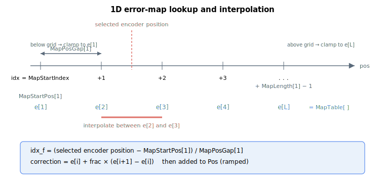

# MapTable/MapTableB/MapTableC/MapTableD/MapTableE

Arrays of position-error correction values used by error mapping.

## Overview

`MapTable` and its extended variants `MapTableB` through `MapTableE` are axis-scoped arrays that store the position-error correction values (in encoder counts) used by error mapping. At each map point — defined by [MapStartPos](MapStartPos.md), [MapPosGap](MapPosGap.md), and [MapLength](MapLength.md), for the map selected by [MapType](MapType.md) and the source chosen by [MapEncoder](MapEncoder.md) — the table holds the value to **add** to the feedback. The corrected result is [Pos](../10-motion/01-kinematics-status/Pos.md); the uncorrected value is [PosBeforeMap](PosBeforeMap.md), so `Pos − PosBeforeMap` is the (ramped) interpolated table value.

The five banks together form **one continuous, 1-based index space**: [MapStartIndex](MapStartIndex.md) and the per-dimension offsets address it as if it were a single array, and the firmware's fetch routine routes each index to the correct bank. The `B`–`E` banks exist only to extend total capacity — a map can begin in `MapTable` and run on into `MapTableB`, etc.

All variants are saved to flash and cannot be changed while the axis is in motion or the motor is on.



## How it works

### How a stored value becomes a correction

Each control cycle the firmware turns the source encoder reading into a fractional index (see [MapPosGap](MapPosGap.md)), reads the bracketing table entries, and **linearly interpolates**:

$$
correction = e_i + frac \times (e_{i+1} - e_i)
$$

For 2D this is done bilinearly (4 entries), for 3D trilinearly (8 entries). The result, plus the [MapErrOffset](MapErrOffset.md) component, is scaled by the engage ramp and added to `EncoderPos` to form `Pos`. Outside the mapped range the value is **clamped** to the first or last entry (no extrapolation).

### Continuous index space and bank boundaries

Indexing is 1-based and the banks chain head-to-tail. The exact boundary index where each bank begins is **product-dependent** (the bank sizes differ between the standalone controller and central-i, and between flash configurations), but the *ordering* is fixed:

| Bank | Position in the index space |
|------|-----------------------------|
| `MapTable[1…]` | first bank — start of the table |
| `MapTableB[1…]` | immediately after the last `MapTable` entry |
| `MapTableC[1…]` | immediately after `MapTableB` |
| `MapTableD[1…]` | immediately after `MapTableC` |
| `MapTableE[1…]` | immediately after `MapTableD` |

In practice `MapTable` is the large bank on every build; `MapTableB…E` are small on the standalone controller and on the standard central-i image, and only become large under the extended-flash central-i configuration. Set [MapStartIndex](MapStartIndex.md) and [MapLength](MapLength.md) so the whole map fits within the combined capacity from the start index onward.

## Examples

```text
AMapTable[1]=12      ; correction value at the first map point (encoder counts)
AMapTable[1]         ; read the correction at the first map point
AMapTableB[1]        ; read the first entry of the second bank
```

## See also

- [MapType](MapType.md) — enables mapping and selects 1D/2D/3D
- [MapStartPos](MapStartPos.md) — start position of each map dimension
- [MapLength](MapLength.md) — number of points per dimension
- [MapPosGap](MapPosGap.md) — spacing between points
- [MapEncoder](MapEncoder.md) — encoder source per dimension
- [MapStartIndex](MapStartIndex.md) — table index where the active map begins
- [PosBeforeMap](PosBeforeMap.md) — feedback position before these corrections are applied
