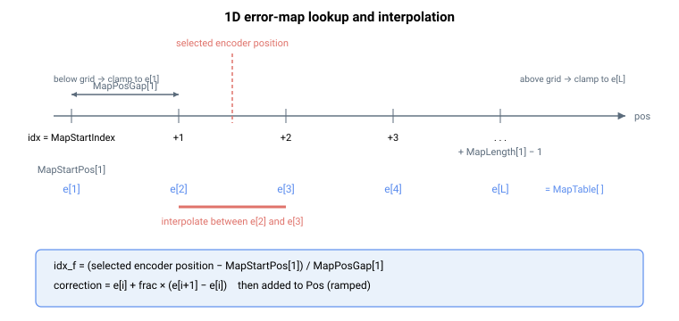

# MapTable/MapTableB/MapTableC/MapTableD/MapTableE

误差映射所用的位置误差修正值数组。

## 概述

`MapTable` 及其扩展变体 `MapTableB` 至 `MapTableE` 是轴相关数组，用于存储误差映射所用的位置误差修正值（以编码器计数表示）。在每个映射点上——由 [MapStartPos](MapStartPos.md)、[MapPosGap](MapPosGap.md) 和 [MapLength](MapLength.md) 定义，针对 [MapType](MapType.md) 所选的映射和 [MapEncoder](MapEncoder.md) 所选的源——该表保存要**加到**反馈上的值。修正后的结果是 [Pos](../10-motion/01-kinematics-status/Pos.md)；未修正的值是 [PosBeforeMap](PosBeforeMap.md)，因此 `Pos − PosBeforeMap` 即为（经斜坡的）插值表值。

五个区块一起构成**一个连续的、从 1 开始的索引空间**：[MapStartIndex](MapStartIndex.md) 和按维度的偏移将其作为单个数组寻址，固件的取值例程将每个索引路由到正确的区块。`B`–`E` 区块的存在仅为扩展总容量——一个映射可以在 `MapTable` 中开始并继续延伸到 `MapTableB`，依此类推。

所有变体均保存至闪存，且无法在轴运动中或电机使能时修改。



## 工作原理

### 存储值如何成为修正值

每个控制周期，控制器将源编码器读数转换为小数索引（参见 [MapPosGap](MapPosGap.md)），读取相邻的表条目，并进行**线性插值**：

$$
\text{correction} = e_i + \text{frac} \cdot (e_{i+1} - e_i)
$$

对于 2D 采用双线性插值（4 个条目），对于 3D 采用三线性插值（8 个条目）。该结果，加上 [MapErrOffset](MapErrOffset.md) 分量，按接入斜坡缩放后加到未修正反馈（[PosBeforeMap](PosBeforeMap.md)）上以构成 `Pos`。超出映射范围时，该值被**钳位**到第一个或最后一个条目（不外推）。

### 连续索引空间与区块边界

索引从 1 开始，各区块首尾相连。各区块开始处的确切边界索引是**与产品相关的**（区块大小在 standalone 控制器与 central-i 之间不同，在不同闪存配置之间也不同），但其*排序*是固定的：

| 区块 | 在索引空间中的位置 |
|------|-----------------------------|
| `MapTable[1…]` | 第一个区块——表的起始 |
| `MapTableB[1…]` | 紧接最后一个 `MapTable` 条目之后 |
| `MapTableC[1…]` | 紧接 `MapTableB` 之后 |
| `MapTableD[1…]` | 紧接 `MapTableC` 之后 |
| `MapTableE[1…]` | 紧接 `MapTableD` 之后 |

实际上，`MapTable` 在每个版本上都是大区块；`MapTableB…E` 在 standalone 控制器上以及在标准 central-i 镜像上都较小，仅在扩展闪存的 central-i 配置下才变大。请设置 [MapStartIndex](MapStartIndex.md) 和 [MapLength](MapLength.md)，使整个映射从起始索引起就能完全容纳在合并容量之内。

## 示例

```text
AMapTable[1]=12      ; correction value at the first map point (encoder counts)
AMapTable[1]         ; read the correction at the first map point
AMapTableB[1]        ; read the first entry of the second bank
```

### 边界情况

- **索引 0** —— 无效；有效索引为 `[1…N]`，其中 `N` 为区块大小。
- **写入时电机使能 / 运动中** —— 电机使能或轴运动中时拒绝写入。
- **索引超出范围** —— 被参数表拒绝；请参考产品的区块大小。
- **映射关闭**（[MapType](MapType.md) = 0）—— 表被存储但不被读取。
- **仿真电机** —— 完全跳过映射；表被存储但不产生修正。
- **超出映射范围** —— `[MapStartPos, MapStartPos + (MapLength − 1) × MapPosGap]` 之外的读数钳位到边界条目；不外推。
- **仅编码器计数** —— 单位是源 [MapEncoder](MapEncoder.md) 的修正前编码器计数，而非用户单位。
- **保存** —— 可保存至闪存；大表在重启后保持。

## 另请参阅

- [MapType](MapType.md) —— 启用映射并选择 1D/2D/3D
- [MapStartPos](MapStartPos.md) —— 每个映射维度的起始位置
- [MapLength](MapLength.md) —— 每个维度的点数
- [MapPosGap](MapPosGap.md) —— 点之间的间距
- [MapEncoder](MapEncoder.md) —— 每个维度的编码器源
- [MapStartIndex](MapStartIndex.md) —— 活动映射开始处的表索引
- [PosBeforeMap](PosBeforeMap.md) —— 应用这些修正之前的反馈位置
