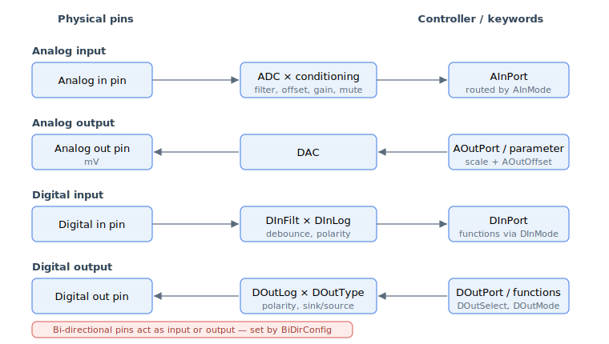

# Inputs/outputs

Agito controllers provide programmable general-purpose analog and digital I/O. This category groups the keywords that read, condition, and drive those signals.

Each path runs between a physical pin and a keyword the application reads or writes: analog inputs are digitised and conditioned into [AInPort](02-analog-inputs/AInPort.md); analog outputs convert a commanded value or monitored parameter to a voltage through the DAC; digital inputs are debounced and stored in [DInPort](04-digital-inputs/DInPort-DInPortHigh.md); digital outputs are driven from manual values or assigned functions. Bi-directional pins can act as either an input or an output, selected by [BiDirConfig](01-general-keywords/BiDirConfig.md).

- **General keywords** — pin-level configuration shared across I/O: [BiDirConfig](01-general-keywords/BiDirConfig.md) sets the direction of bi-directional pins.
- **Analog inputs** — a conditioning chain (filter → offset → deadband → gain → mute) feeding [AInPort](02-analog-inputs/AInPort.md); function assignment via [AInMode](02-analog-inputs/AInMode.md). See the [analog-input signal path](02-analog-inputs/00-overview.md).
- **Analog outputs** — direct command ([AOutPort](03-analog-outputs/AOutPort.md)) or parameter monitoring, scaled by [AOutShifts](03-analog-outputs/AOutShifts.md) (or the v5 floating-point [AOutGain](03-analog-outputs/AOutGain.md)) and offset by [AOutOffset](03-analog-outputs/AOutOffset.md); mode set by [AOutMode](03-analog-outputs/AOutMode.md).
- **Digital inputs** — debounce ([DInFilt](04-digital-inputs/DInFilt.md)), inversion ([DInLog/DInLogHigh](04-digital-inputs/DInLog-DInLogHigh.md)), state ([DInPort/DInPortHigh](04-digital-inputs/DInPort-DInPortHigh.md)), and function assignment ([DInMode](04-digital-inputs/DInMode.md)).
- **Digital outputs** — hardware function ([DOutSelect](05-digital-outputs/DOutSelect.md)), software status ([DOutMode](05-digital-outputs/DOutMode.md)), or manual control ([DOutPort](05-digital-outputs/DOutPort.md) and atomic [set/clear/toggle](05-digital-outputs/DOutPortSBit-DOutPortCBit-DOutPortTBit.md)); plus sink/source type ([DOutType](05-digital-outputs/DOutType.md)), inversion ([DOutLog](05-digital-outputs/DOutLog.md)), and user PWM ([UserPWM](05-digital-outputs/UserPWM.md) / [UserPWMDiv](05-digital-outputs/UserPWMDiv.md)).

**Indexing note:** bit-packed variables (e.g. `DInPort`, `DOutPort`, `DOutType`, `DOutLog`) use 0-based **bit** positions (bit 0 = I/O 1). Array-type keywords (e.g. `DInMode`, `DOutMode`, `DOutSelect`, `AInGain`) use 1-based **array** indexing (index 1 = I/O 1). Not all products have the same number of I/Os; writing an unused index has no effect.
