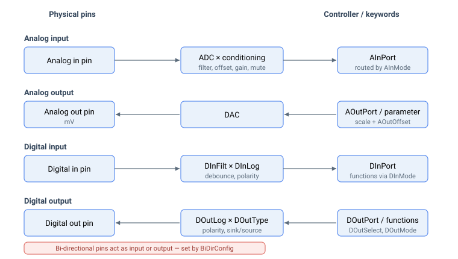

# 输入/输出

Agito 控制器提供可编程的通用模拟量与数字量 I/O。本类别归集了用于读取、调理和驱动这些信号的关键字。

每一条路径都在一个物理引脚与应用读取或写入的关键字之间运行：模拟量输入经过数字化并调理后进入 [AInPort](02-analog-inputs/AInPort.md)；模拟量输出通过 DAC 将指令值或被监控参数转换为电压；数字量输入经过消抖后存入 [DInPort](04-digital-inputs/DInPort-DInPortHigh.md)；数字量输出由手动值或所分配的功能驱动。双向引脚可作为输入或输出，由 [BiDirConfig](01-general-keywords/BiDirConfig.md) 选择。

- **通用关键字**——跨 I/O 共享的引脚级配置：[BiDirConfig](01-general-keywords/BiDirConfig.md) 设置双向引脚的方向。
- **模拟量输入**——一条调理链（滤波 → 偏置 → 死区 → 增益 → 静音）馈入 [AInPort](02-analog-inputs/AInPort.md)；功能分配通过 [AInMode](02-analog-inputs/AInMode.md)。参见[模拟量输入信号路径](02-analog-inputs/00-overview.md)。
- **模拟量输出**——直接指令（[AOutPort](03-analog-outputs/AOutPort.md)）或参数监控，由 [AOutShifts](03-analog-outputs/AOutShifts.md)（或 v5 浮点型 [AOutGain](03-analog-outputs/AOutGain.md)）缩放，并由 [AOutOffset](03-analog-outputs/AOutOffset.md) 偏置；模式由 [AOutMode](03-analog-outputs/AOutMode.md) 设置。
- **数字量输入**——消抖（[DInFilt](04-digital-inputs/DInFilt.md)）、反相（[DInLog/DInLogHigh](04-digital-inputs/DInLog-DInLogHigh.md)）、状态（[DInPort/DInPortHigh](04-digital-inputs/DInPort-DInPortHigh.md)）以及功能分配（[DInMode](04-digital-inputs/DInMode.md)）。
- **数字量输出**——硬件功能（[DOutSelect](05-digital-outputs/DOutSelect.md)）、软件状态（[DOutMode](05-digital-outputs/DOutMode.md)）或手动控制（[DOutPort](05-digital-outputs/DOutPort.md) 以及原子的[置位/清零/翻转](05-digital-outputs/DOutPortSBit-DOutPortCBit-DOutPortTBit.md)）；另有汇/源类型（[DOutType](05-digital-outputs/DOutType.md)）、反相（[DOutLog](05-digital-outputs/DOutLog.md)）以及用户 PWM（[UserPWM](05-digital-outputs/UserPWM.md) / [UserPWMDiv](05-digital-outputs/UserPWMDiv.md)）。

**索引说明：** 位打包变量（例如 `DInPort`、`DOutPort`、`DOutType`、`DOutLog`）使用从 0 开始的**位**位置（bit 0 = I/O 1）。数组型关键字（例如 `DInMode`、`DOutMode`、`DOutSelect`、`AInGain`）使用从 1 开始的**数组**索引（index 1 = I/O 1）。并非所有产品具有相同数量的 I/O；写入一个未使用的索引不会产生任何作用。
