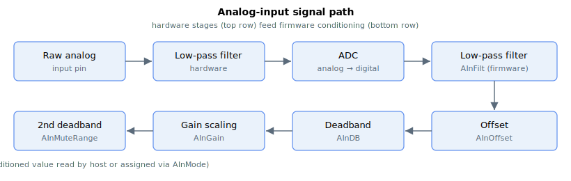

# Analog inputs

For analog inputs, the signals path is as shown.

The raw electrical input (AInPort[5-8])is passed through an analog second-order low-pass filter. Then, the filtered electrical signal is passed to the ADC for conversion. The converted signal is passed through a digital filter (AInFilt), before being adjusted for offset (AInOffset). Next, the signal is passed through the first deadband filter (AInDB) before it is multiplied by a DC gain (AInGain). Finally, the signal is passed through the second deadband filter (AInMuteRange) before being output as the result (AInPort[1-4]).

The overall formula for analog input is given by,

$$
AInPort\ \lbrack mV\rbrack = p\left( \frac{AInGain}{65536}*\ h\left( g\left( f\left( Raw\ input\ \lbrack mV\rbrack \right) \right) + AInOffset\ \lbrack mV\rbrack \right)\  \right)
$$

where $f$, $g$, $h$ and $p$ are functions of analog filter, digital filter, first deadband filter and second deadband filter, respectively.

**Note:**

1. Different products will have hardware low-pass filters.
2. Not all products contain the same number of I/Os. Changing the keyword array at the unused indices will not produce any change. For example, if the product has only 2 analog inputs, changing AInGain[3] will not make any change.
