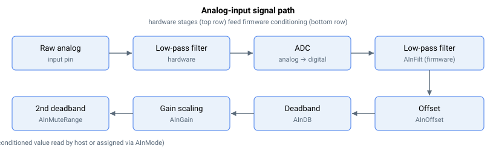

# 模拟量输入

对于模拟量输入，信号路径如图所示。

原始电气输入（`AInPort[5-8]`）经过一个模拟二阶低通滤波器。随后，滤波后的电气信号被送往 ADC 进行转换。转换后的信号经过一个数字滤波器（AInFilt），然后进行偏置调整（AInOffset）。接着，信号经过第一个死区滤波器（AInDB），再乘以一个直流增益（AInGain）。最后，信号经过第二个死区滤波器（AInMuteRange），然后作为结果（`AInPort[1-4]`）输出。

模拟量输入的总体公式为：

$$
\text{AInPort}\ [\text{mV}] = p\!\left( \frac{\text{AInGain}}{65536} \cdot h\!\left( g\!\left( f\!\left( \text{Raw input}\ [\text{mV}] \right) \right) + \text{AInOffset}\ [\text{mV}] \right) \right)
$$

其中 $f$、$g$、$h$ 和 $p$ 分别为模拟滤波器、数字滤波器、第一死区滤波器和第二死区滤波器的函数。

**注意：**

1. 不同产品可能配有硬件低通滤波器。
2. 并非所有产品包含相同数量的 I/O。在未使用的索引处更改关键字数组不会产生任何变化。例如，如果产品仅有 2 个模拟量输入，更改 AInGain[3] 不会产生任何变化。
