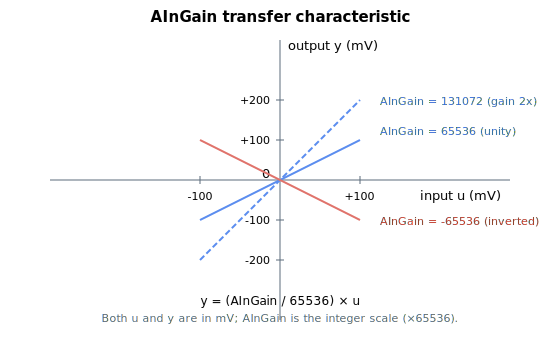

# AInGain

DC gain (×65536 fixed-point) applied to each analog input.

## Overview

`AInGain` is the analog-input DC gain, stored as the actual gain multiplied by 65536 so that fractional gains can be represented with an integer. It is the gain stage of the [analog-input signal path](00-overview.md), applied after the first deadband ([AInDB](AInDB.md)) and before the mute range ([AInMuteRange](AInMuteRange.md)). The array index is the analog-input number (e.g. `AInGain[1]` is analog input 1).

## How it works

In the per-cycle conditioning, the deadband output is multiplied by `AInGain` scaled by 1/65536:

$$
y = \frac{\text{AInGain}}{65536}\,u
$$

Both input and output are in millivolts. A negative `AInGain` inverts the input. For unity gain, set `AInGain = 65536`.



## Examples

```text
AAInGain[1]=131072   ; gain of 2.0 on analog input 1
AAInGain[1]=65536    ; unity gain
AAInGain[1]=-65536   ; invert analog input 1
```

### Edge cases

- **Index 0** — invalid; valid indices are `AInGain[1]`–`AInGain[4]` (plus `[5]` reserved). `AInGain[0]` does not exist.
- **Zero gain** — `AInGain = 0` zeroes the post-gain stage (the input is fully muted regardless of [AInMuteRange](AInMuteRange.md)).
- **Negative gain** — inverts the signal; the post-gain deadband ([AInMuteRange](AInMuteRange.md)) is symmetric around zero so it still mutes around `0`, not around the inverted level.
- **Saturation** — the post-gain value is held as `float`; once stored in `AInPort[1]–[4]` it is converted to `int32` (or scaled `float32` on v5) and may saturate at the storage range.
- **Motor on/off and mode independence** — the gain runs every cycle regardless of `MotorOn` or [OperationMode](../../08-axis-operation/01-general-keywords/OperationMode.md); the same value feeds every consumer of the input.
- **Save** — `AInGain` is flash-saveable and reloaded at power-up.
- **Platform** — central-i v5 stores `AInGain` as `float32` (rather than `int32`), but the firmware still divides by 65536 internally, so the user-facing scaling is unchanged: `AInGain = 65536` is still unity gain.

## See also

- [AInOffset](AInOffset.md) — offset stage (before the first deadband)
- [AInDB](AInDB.md), [AInMuteRange](AInMuteRange.md) — deadbands around the gain stage
- [AInPort](AInPort.md) — resulting readings
