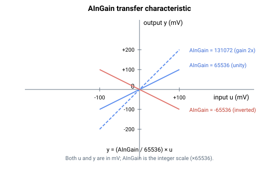

# AInGain

施加于每个模拟量输入的直流增益（×65536 定点）。

## 概述

`AInGain` 为模拟量输入的直流增益，以实际增益乘以 65536 的形式存储，从而能够用整数表示小数增益。它是[模拟量输入信号路径](00-overview.md)的增益环节，在第一级死区（[AInDB](AInDB.md)）之后、静音范围（[AInMuteRange](AInMuteRange.md)）之前施加。数组索引为模拟量输入编号（例如 `AInGain[1]` 表示模拟量输入 1）。

## 工作原理

在逐周期信号调理中，死区输出乘以按 1/65536 缩放的 `AInGain`：

$$
y = \frac{\text{AInGain}}{65536}\,u
$$

输入和输出均以毫伏为单位。负的 `AInGain` 会对输入取反。若需单位增益，设置 `AInGain = 65536`。



## 示例

```text
AAInGain[1]=131072   ; gain of 2.0 on analog input 1
AAInGain[1]=65536    ; unity gain
AAInGain[1]=-65536   ; invert analog input 1
```

### 边界情况

- **索引 0** — 无效；有效索引为 `AInGain[1]`–`AInGain[4]`。`AInGain[0]` 是保留的通信/内部槽位（用户不可访问），且 `AInGain[5]` 不存在。
- **零增益** — `AInGain = 0` 将增益后环节置零（无论 [AInMuteRange](AInMuteRange.md) 如何，输入都被完全静音）。
- **负增益** — 对信号取反；增益后死区（[AInMuteRange](AInMuteRange.md)）关于零对称，因此它仍围绕 `0` 静音，而非围绕取反后的电平。
- **饱和** — 增益后的值以 `float` 保持；一旦存入 `AInPort[1]–[4]` 便会转换为 `int32`（或在 v5 上为缩放的 `float32`），并可能在存储范围处饱和。
- **与电机使能/失能及模式无关** — 无论 `MotorOn` 或 [OperationMode](../../08-axis-operation/01-general-keywords/OperationMode.md) 如何，增益每个周期都运行；同一值馈送该输入的每个使用方。
- **保存** — `AInGain` 可保存至闪存并在上电时重新加载。
- **平台** — central-i v5 将 `AInGain` 存储为 `float32`（而非 `int32`），但固件内部仍除以 65536，因此面向用户的缩放不变：`AInGain = 65536` 仍为单位增益。

## 另请参阅

- [AInOffset](AInOffset.md) — 偏置环节（第一级死区之前）
- [AInDB](AInDB.md)、[AInMuteRange](AInMuteRange.md) — 增益环节两侧的死区
- [AInPort](AInPort.md) — 得到的读数
