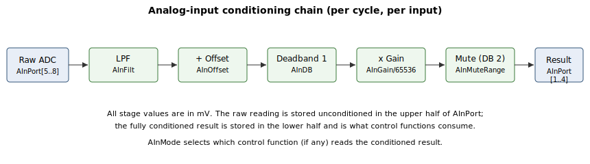

# AInPort

Read-only analog-input readings — processed values and raw ADC values.

## Overview

`AInPort` holds the analog-input readings, in millivolts. Its length is twice the number of analog inputs: the first half holds the **processed** readings (after filter, offset, first deadband, gain, and second deadband), and the second half holds the **original** values straight from the ADC. See the [analog-input signal path](00-overview.md) for the full processing chain.

| Data | Analog input 1 | Analog input 2 | Analog input 3 | Analog input 4 |
|------|----------------|----------------|----------------|----------------|
| Processed input | AInPort[1] | AInPort[2] | AInPort[3] | AInPort[4] |
| Original input | AInPort[5] | AInPort[6] | AInPort[7] | AInPort[8] |

The index is fixed to the physical input — `AInPort[1]` is always analog input 1, `AInPort[2]` is input 2, and so on. On 2-input products only inputs 1–2 (processed) and the corresponding raw entries exist; the others read 0.

## How it works



Each control cycle, the ADC reading for one input is taken into a floating-point working value, stored unchanged in the raw entry (`AInPort[5..8]`), then run through the conditioning chain and stored in the processed entry (`AInPort[1..4]`). The raw count is scaled to millivolts by a fixed hardware factor (e.g. ±12500 mV over ±32768 counts), so both halves of `AInPort` are in mV.

The four inputs are not all conditioned on the same cycle: one input is processed per sample slot, so each input is refreshed at the analog-input update rate rather than every single cycle.

The processed value is what control functions consume once an input is routed with [AInMode](AInMode.md); the raw value is used directly only by the analog position-feedback function. Both are read-only.

## Examples

```text
AAInPort[1]         ; processed reading of analog input 1
AAInPort[5]         ; raw (post-ADC) reading of analog input 1
```

## See also

- [AInFilt](AInFilt.md), [AInOffset](AInOffset.md), [AInDB](AInDB.md), [AInGain](AInGain.md), [AInMuteRange](AInMuteRange.md) — the processing chain that produces `AInPort[1..4]`
- [AInMode](AInMode.md) — assign a function to an analog input
