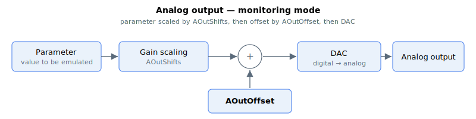

# Analog outputs

The analog outputs can be configured to output a commanded value (direct command mode), or to emulate the value of user selected parameter (monitoring mode). This is configured via AOutMode.

In **direct command mode** (AOutMode = 0), AOutPort is the commanded value and AOutOffset is used to calibrate/zero the output.

In **monitoring mode**, AOutMode selects the parameter to be emulated. The parameter to be emulated is assumed to be in millivolts (mV). For example, if position reference is to be output where PosRef = 4562 counts, then the value entering the signal path is 4562 mV.

The value is scaled with a bit-shifting operation (AOutShifts), before added with an offset (AOutOffset) to produce the final analog output value. The value is converted into physical signal by the DAC.

The overall formula for analog output is given by,

$$
\text{Analog Output}\ [\text{mV}] = \text{Parameter}\ [\text{mV}] \cdot 2^{\text{AOutShifts}} + \text{AOutOffset}\ [\text{mV}]
$$

On **Central-i v5** the power-of-two scaler is replaced by a floating-point gain ([AOutGain](AOutGain.md)) that allows any real multiplier:

$$
\text{Analog Output}\ [\text{mV}] = \text{Parameter}\ [\text{mV}] \cdot \text{AOutGain} + \text{AOutOffset}\ [\text{mV}]
$$

The DAC has a scale of approximately −2.752457 LSB/mV, so the full-scale output is ±11905 mV.

**Note:**

Not all products contain the same number of I/Os. Changing the keyword array at the unused indices will not produce any change. For example, if the product has only 2 analog outputs, changing AOutMode[3] will not make any change.
