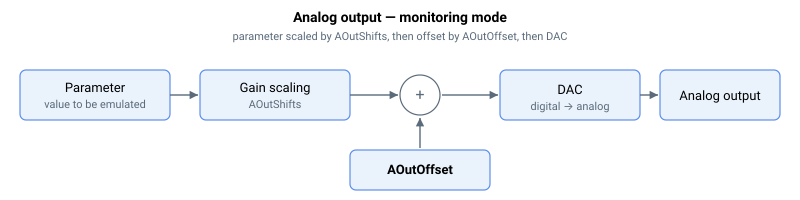

# 模拟量输出

模拟量输出可配置为输出指令值（直接指令模式），或仿真用户所选参数的值（监视模式）。这通过 AOutMode 进行配置。

在**直接指令模式**（AOutMode = 0）下，AOutPort 为指令值，AOutOffset 用于校准/置零输出。

在**监视模式**下，AOutMode 选择要仿真的参数。被仿真的参数被视为以毫伏（mV）为单位。例如，若要输出位置参考，且 PosRef = 4562 counts，则进入信号路径的值为 4562 mV。

该值先经过移位运算（AOutShifts）进行缩放，再加上偏置（AOutOffset），从而生成最终的模拟量输出值。该值由 DAC 转换为物理信号。

模拟量输出的整体公式为：

$$
\text{Analog Output}\ [\text{mV}] = \text{Parameter}\ [\text{mV}] \cdot 2^{\text{AOutShifts}} + \text{AOutOffset}\ [\text{mV}]
$$

在 **Central-i v5** 上，2 的幂缩放器被替换为浮点增益（[AOutGain](AOutGain.md)），从而允许任意实数乘子：

$$
\text{Analog Output}\ [\text{mV}] = \text{Parameter}\ [\text{mV}] \cdot \text{AOutGain} + \text{AOutOffset}\ [\text{mV}]
$$

DAC 的标度约为 −2.752457 LSB/mV，因此满量程输出为 ±11905 mV。

**注意：**

并非所有产品都包含相同数量的 I/O。在未使用的索引处更改关键字数组不会产生任何变化。例如，若产品仅有 2 个模拟量输出，更改 AOutMode[3] 不会产生任何变化。
