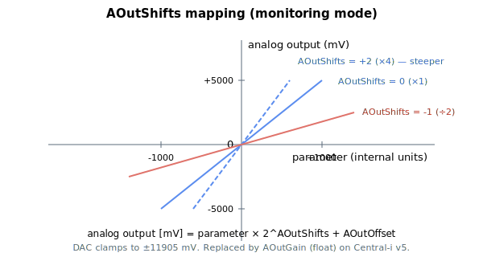

# AOutShifts

Power-of-two scaling applied to the monitored parameter on an analog output.

## Overview

`AOutShifts` scales the monitored parameter (see [AOutMode](AOutMode.md)) by a power of two, to fit it into the output's dynamic range. The array index is the analog-output number (1-based: `AOutShifts[1]` applies to analog output 1). This is the scaling stage of the [analog-output signal path](00-overview.md) and applies **only in monitoring mode** — in direct command mode the output follows [AOutPort](AOutPort.md) and `AOutShifts` is not used.

## How it works

Each control cycle, for an output in monitoring mode, the monitored parameter has an arithmetic bit shift applied before adding the offset and converting to a DAC code:

```text
if (AOutShifts < 0)  value = parameter >> (-AOutShifts);   // shift right (divide)
else                 value = parameter <<   AOutShifts;    // shift left  (multiply)
DAC code = (value + AOutOffset) * (mV-to-DAC factor);
```

A **positive** value shifts left — multiplying the value by $2^{\text{AOutShifts}}$. A **negative** value shifts right — dividing by $2^{|\text{AOutShifts}|}$. The range ±31 reflects the width of the 32-bit shift.

$$
\text{Analog output [mV]} = \text{Monitored parameter [internal units]} \cdot 2^{\text{AOutShifts}}
$$

Because the shift is on a signed integer, a right shift truncates toward negative infinity. Pick a shift so the parameter's working range maps usefully onto the ±11905 mV output span.



## Changes between versions

`AOutShifts` is the v4 mechanism (standalone and Central-i). On **Central-i v5** it is replaced by the floating-point gain [AOutGain](AOutGain.md), which allows any real multiplier instead of only powers of two.

## Examples

```text
AAOutShifts[1]=2     ; multiply the monitored value by 4
AAOutShifts[1]=-3    ; divide the monitored value by 8
AAOutShifts[1]        ; read back the shift
```

## See also

- [AOutMode](AOutMode.md) — selects the monitored parameter (shift applies only in monitoring mode)
- [AOutGain](AOutGain.md) — the v5 floating-point gain that replaces this shift
- [AOutOffset](AOutOffset.md) — output offset (added after this scaling, before the DAC conversion)
- [AOutPort](AOutPort.md) — direct-mode value (not affected by this shift)
- [analog-output overview](00-overview.md) — full signal path
