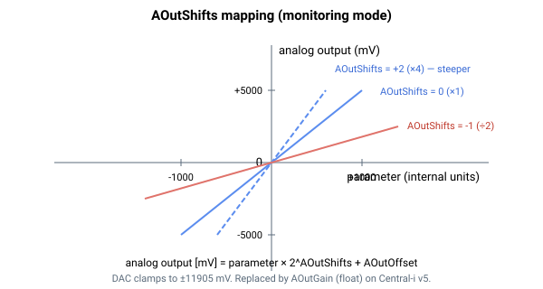

# AOutShifts

应用于模拟量输出上被监视参数的 2 的幂次缩放。

## 概述

`AOutShifts` 将被监视参数（见 [AOutMode](AOutMode.md)）按 2 的幂次缩放，以使其适配输出的动态范围。数组索引即模拟量输出编号（从 1 开始：`AOutShifts[1]` 应用于模拟量输出 1）。这是[模拟量输出信号路径](00-overview.md)中的缩放环节，**仅在监视模式下**适用——在直接指令模式下，输出跟随 [AOutPort](AOutPort.md)，不使用 `AOutShifts`。

## 工作原理

每个控制周期，对于处于监视模式的输出，被监视参数会在相加偏置并转换为 DAC 码之前先进行算术位移：

```text
if (AOutShifts < 0)  value = parameter >> (-AOutShifts);   // shift right (divide)
else                 value = parameter <<   AOutShifts;    // shift left  (multiply)
DAC code = (value + AOutOffset) * (mV-to-DAC factor);
```

**正**值左移——将该值乘以 $2^{\text{AOutShifts}}$。**负**值右移——除以 $2^{|\text{AOutShifts}|}$。±31 的范围反映了 32 位移位的位宽。

$$
\text{Analog output [mV]} = \text{Monitored parameter [internal units]} \cdot 2^{\text{AOutShifts}}
$$

由于移位作用于带符号整数，右移会向负无穷方向截断。请选择一个合适的移位量，使参数的工作范围有效地映射到 ±11905 mV 的输出区间上。



## 版本间的变化

`AOutShifts` 是 v4 的机制（standalone 与 Central-i）。在 **Central-i v5** 上，它被浮点增益 [AOutGain](AOutGain.md) 取代，后者允许任意实数乘子，而不仅限于 2 的幂次。

## 示例

```text
AAOutShifts[1]=2     ; multiply the monitored value by 4
AAOutShifts[1]=-3    ; divide the monitored value by 8
AAOutShifts[1]        ; read back the shift
```

### 边界情况

- **索引 0** —— 无效；有效索引为 `AOutShifts[1]`–`AOutShifts[4]`。`AOutShifts[0]` 不存在。
- **超出范围** —— 超出 ±31 的值会被参数表拒绝。
- **错误模式**（[AOutMode](AOutMode.md) = 0，直接指令）—— **不使用** `AOutShifts`；DAC 直接跟随 [AOutPort](AOutPort.md)。
- **右移符号** —— 固件对带符号整数使用算术右移，因此负值会**向负无穷方向**取整（例如 `−1 >> 1 = −1`），而非向零取整。在 0 附近进行非常大的右移时需注意这一点。
- **饱和** —— 经移位、经偏置后的 DAC 码会被钳位至 ±11905 mV 的输出区间。
- **电机使能／失能** —— 无论 `MotorOn` 状态如何，每个周期都运行。
- **保存** —— 可保存至闪存；启动时重新载入。
- **平台** —— 仅 standalone v4 和 central-i v4。在 central-i v5 上请使用 [AOutGain](AOutGain.md) 以获得任意实数乘子。

## 参见

- [AOutMode](AOutMode.md) —— 选择被监视参数（移位仅在监视模式下适用）
- [AOutGain](AOutGain.md) —— 取代此移位的 v5 浮点增益
- [AOutOffset](AOutOffset.md) —— 输出偏置（在本缩放之后、DAC 转换之前相加）
- [AOutPort](AOutPort.md) —— 直接模式值（不受此移位影响）
- [analog-output overview](00-overview.md) —— 完整信号路径
